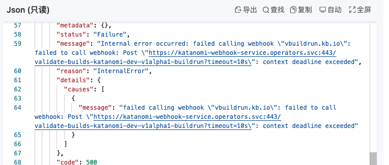
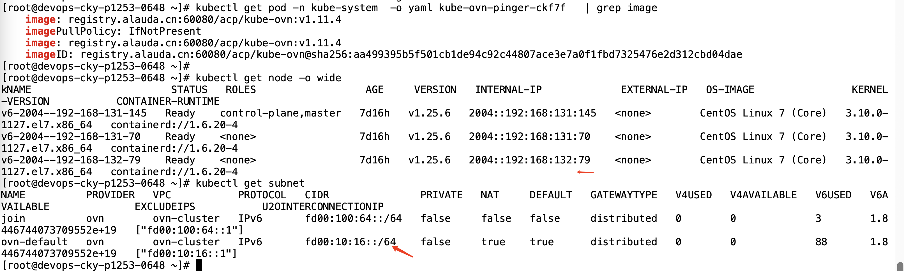
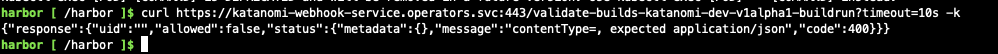
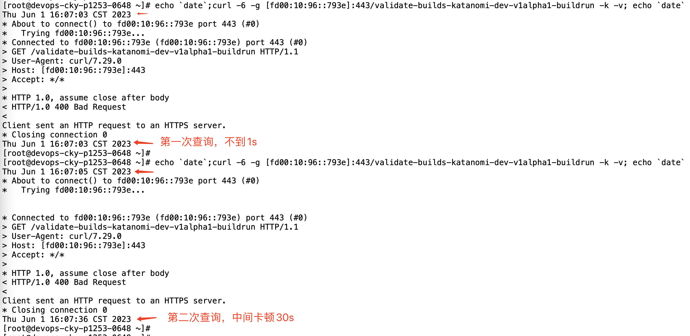
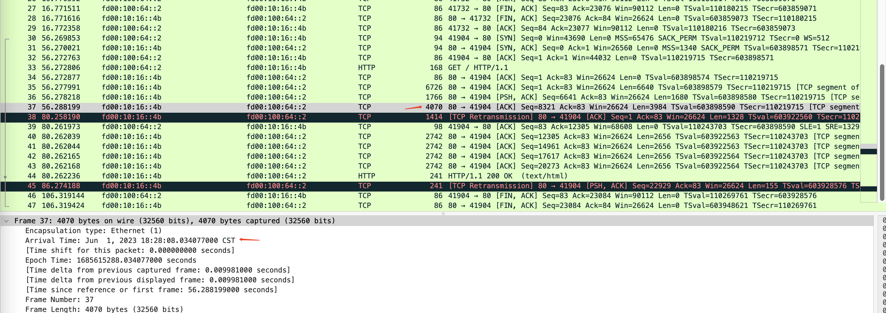
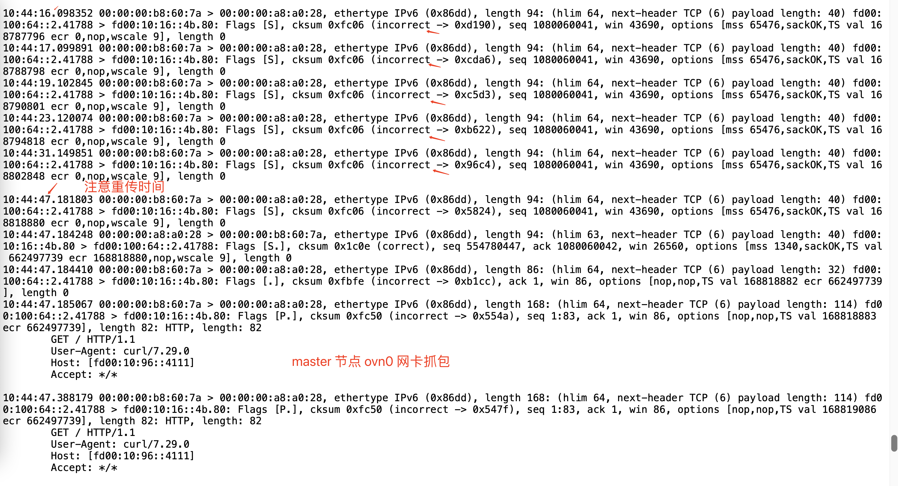
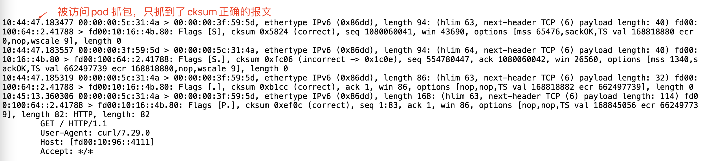

---
kind:
  - Troubleshooting
products:
  - Alauda Container Platform
  - Alauda DevOps
  - Alauda AI
  - Alauda Application Services
  - Alauda Service Mesh
  - Alauda Developer Portal
ProductsVersion:
  - 4.1.0,4.2.x
---
<!-- A type of document that involves encountering a fault, diagnosing it, performing root cause analysis, and providing solutions. -->

# IPv6 集群，跨节点 svc 访问，存在卡顿现象

创建流水线时访问webhook超时失败 跨节点访问SVC IP+Port首次正常后续卡顿 ovn0网卡因cksum error导致SYN报文被丢弃

## Cause
- geneve_sys_6081接口校验和错误导致TCP SYN报文被丢弃

## Resolution
- 执行 ethtool -K genev_sys_6081 tx off 关闭各节点校验

## [workaround]

## [Related Information]
**Screenshots**

- Environment: IPv6集群环境，CNI版本kube-ovn:v1.11.4
- genev_sys_6081
- kube-ovn
- SVC IP+Port
- ovn0网卡
- TCP SYN报文
- Component: Kube-APIServer
- Page ID: 149594296
- Original Title: IPv6 集群，跨节点 svc 访问，存在卡顿现象
