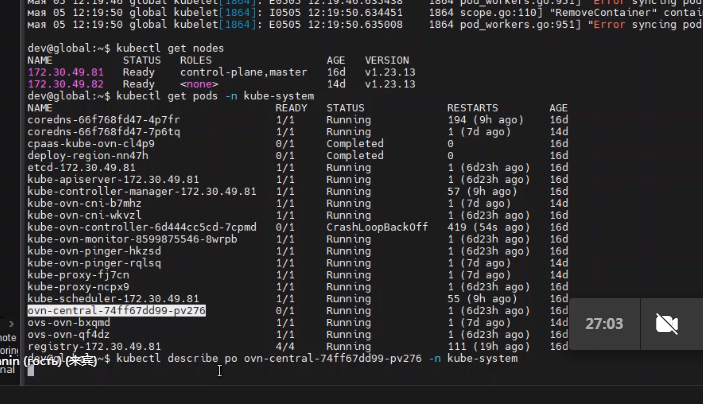
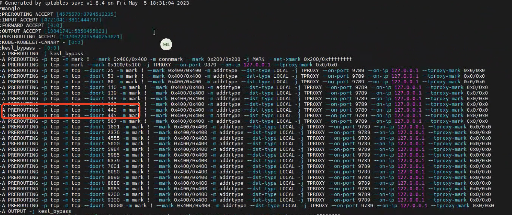

---
kind:
  - Troubleshooting
products:
  - Alauda Container Platform
  - Alauda DevOps
  - Alauda AI
  - Alauda Application Services
  - Alauda Service Mesh
  - Alauda Developer Portal
ProductsVersion:
  - 4.1.0,4.2.x
---
<!-- A type of document that involves encountering a fault, diagnosing it, performing root cause analysis, and providing solutions. -->

# 3.10.2

无法查看集群信息 ovn组件crash

## Cause
- 443端口请求被转发到9789端口
- 9789端口被卡巴斯基网络安全组件占用

## Resolution
- 停用卡巴斯基服务

## [workaround]

## [Related Information]
**Screenshots**

2、排查发现主机443端口的请求被转发到了9789端口，影响ovn组件请求apiserver
- Environment: 3.10.2
- ovn组件
- apiserver
- 443端口
- 9789端口
- 卡巴斯基网络安全组件
- Component: Kube-APIServer
- Page ID: 151879951
- Original Title: 3.10.2-容器平台-无法查看集群信息
