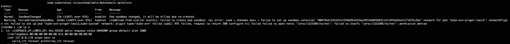

---
kind:
  - Troubleshooting
products:
  - Alauda Container Platform
  - Alauda DevOps
  - Alauda AI
  - Alauda Application Services
  - Alauda Service Mesh
  - Alauda Developer Portal
ProductsVersion:
  - 4.1.0,4.2.x
---
<!-- A type of document that involves encountering a fault, diagnosing it, performing root cause analysis, and providing solutions. -->

# apiserver报错请求cert

apiserver报错请求cert-manager webhook被拒绝 日志显示错误：referenced signer resource does not exist: {cpaas-ca ClusterIssuer ait.alauda.io} cert-manager容器日志报错签发证书失败

## Cause
- 注册了不存在的apiGroup ait.alauda.io
- 证书资源引用了不存在的ClusterIssuer cpaas-ca

## Resolution
- 当前zeus功能实现方式无法避免该报错（通过注册不存在的apiGroup实现证书过期时间展示功能）

## [workaround]

## [Related Information]
**Screenshots**
1、检查cert-manager相关容器运行正常，cert-manager容器日志报错签发证书失败，报错Forbiden: reference signer resource does not exist:{cpaas-ca ClusterIssuer ait.alauda.io}

- Environment: Kubernetes 3.8/3.10/3.12
- cert-manager webhook
- ClusterIssuer
- cert-manager.io/issuer-group
- cert-manager.io/issuer-kind
- ait.alauda.io
- Component: Kube-APIServer
- Page ID: 152656010
- Original Title: apiserver报错请求cert-manager webhook被拒绝
