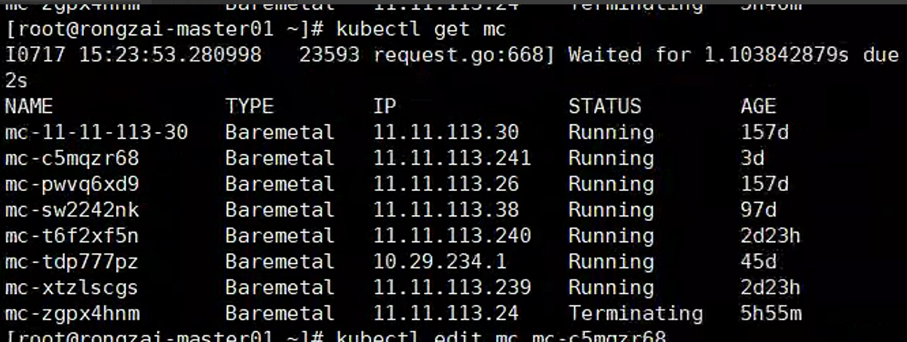
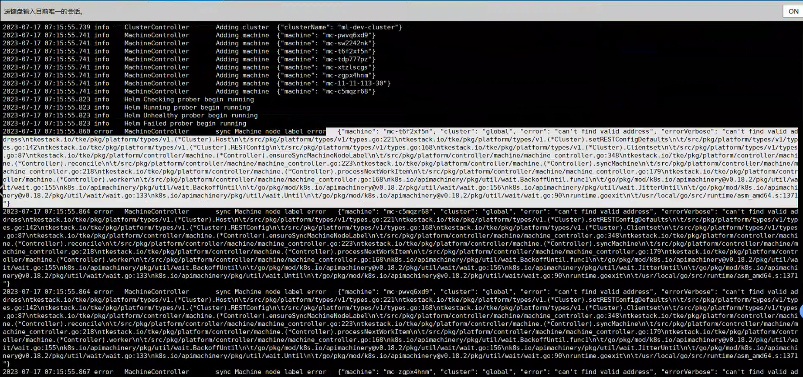

---
kind:
  - Troubleshooting
products:
  - Alauda Container Platform
  - Alauda DevOps
  - Alauda AI
  - Alauda Application Services
  - Alauda Service Mesh
  - Alauda Developer Portal
ProductsVersion:
  - 4.1.0,4.2.x
---
<!-- A type of document that involves encountering a fault, diagnosing it, performing root cause analysis, and providing solutions. -->

# tke platform controller异常

tke platform controller一直crash 报错 sync machine node label error can't find valid address

## Cause
- cluster资源中publicAlternativeNames字段被多更改

## Resolution
- 还原备份的global cluster资源yaml

## [workaround]

## [Related Information]
**Screenshots**

- Environment: TKE 3.8.3
- cluster资源
- publicAlternativeNames
- tke-platform-controller
- etcd
- apiserver
- Component: Kube-APIServer
- Page ID: 152657607
- Original Title: tke platform controller异常
