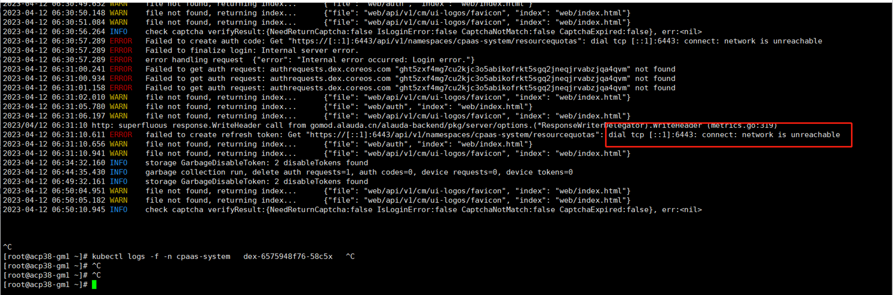

---
kind:
  - Troubleshooting
products:
  - Alauda Container Platform
  - Alauda DevOps
  - Alauda AI
  - Alauda Application Services
  - Alauda Service Mesh
  - Alauda Developer Portal
ProductsVersion:
  - 4.1.0,4.2.x
---
<!-- A type of document that involves encountering a fault, diagnosing it, performing root cause analysis, and providing solutions. -->

# 3.8

无法登录平台 UI登录页面报错ipv6回环地址的6443端口不通 apiserver和dex组件日志报错：Error from server: Get "https://[::1]:6443/api/v1/namespaces/victor/resourcequotas": dial tcp [::1]:

## Cause
- sysctl参数 net.ipv6.conf.lo.disable_ipv6=1 关闭了ipv6回环地址
- 内核参数 net.ipv6.conf.all.disable_ipv6=1 和 net.ipv6.conf.default.disable_ipv6=1 禁用了全局IPv6

## Resolution
- 修改 /etc/sysctl.conf 配置：net.ipv6.conf.all.disable_ipv6=0, net.ipv6.conf.default.disable_ipv6=0, net.ipv6.conf.lo.disable_ipv6=0
- 执行 sysctl --system 重新加载配置
- 重启dex和apiserver组件

## [workaround]

## [Related Information]
**Screenshots**

- apiserver
- dex
- 6443端口
- net.ipv6.conf.all.disable_ipv6
- net.ipv6.conf.default.disable_ipv6
- net.ipv6.conf.lo.disable_ipv6
- Component: Kube-APIServer
- Page ID: 152658692
- Original Title: 3.8-sysctl的ipv6参数导致界面登录失败。
