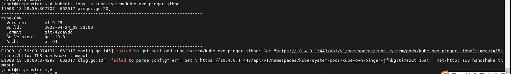
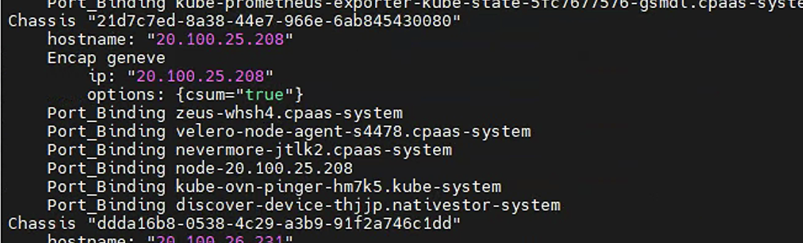
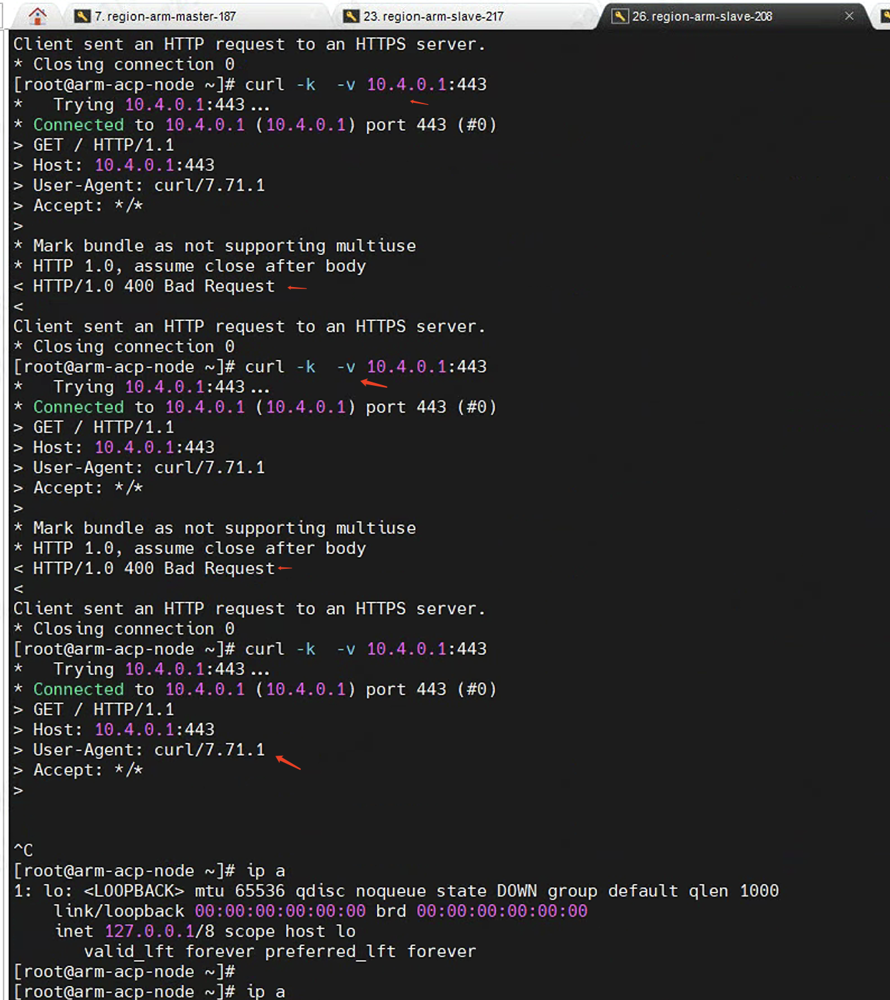
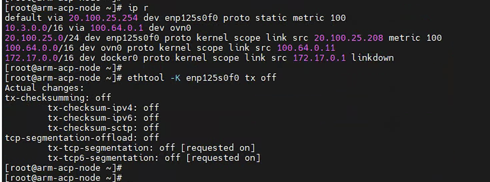
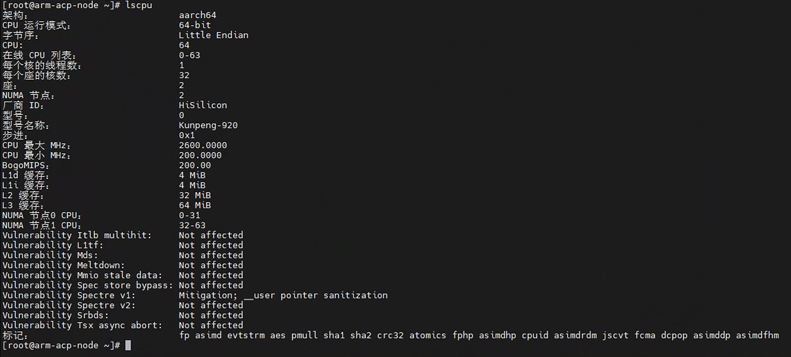

---
kind:
  - Troubleshooting
products:
  - Alauda Container Platform
  - Alauda DevOps
  - Alauda AI
  - Alauda Application Services
  - Alauda Service Mesh
  - Alauda Developer Portal
ProductsVersion:
  - 4.1.0,4.2.x
---
<!-- A type of document that involves encountering a fault, diagnosing it, performing root cause analysis, and providing solutions. -->

# 温州银行，集群新加节点，容器网络访问apiserver异常

新节点上的kube-ovn-pinger pod无法正常启动，报错访问不了apiserver 从pinger pod的netns中测试访问apiserver时概率性不通

## Cause
- 跨节点访问svc时存在checksum校验问题

## Resolution
- 执行命令关闭节点网卡tx校验: ethtool -K enp1s0 tx off

## [workaround]

## [Related Information]
**Screenshots**

- Environment: 操作系统：kylin系统 | CNI版本：Kube-OVN v1.9.25 | 其他信息：ACP3.12
- kube-ovn-pinger
- OVN DB
- 默认子网(集中式子网)
- enp1s0
- Component: Kube-APIServer
- Page ID: 164987943
- Original Title: 温州银行，集群新加节点，容器网络访问apiserver异常
