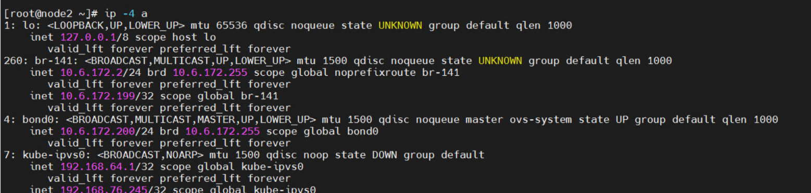

---
kind:
  - Troubleshooting
products:
  - Alauda Container Platform
  - Alauda DevOps
  - Alauda AI
  - Alauda Application Services
  - Alauda Service Mesh
  - Alauda Developer Portal
ProductsVersion:
  - 4.1.0,4.2.x
---
<!-- A type of document that involves encountering a fault, diagnosing it, performing root cause analysis, and providing solutions. -->

# 单网卡 underlay环境，和keep

节点访问不通 apiserver alive 网卡配置了 VIP 地址

## Cause
- keep-alived 配置的 VIP 地址与 underlay 环境地址冲突

## Resolution
- 重新搭建环境

## [workaround]

## [Related Information]
**Screenshots**

- keep-alived
- underlay 网络
- apiserver
- VIP 地址
- Component: Kube-APIServer
- Page ID: 221885775
- Original Title: 单网卡 underlay环境，和keep-alived 地址冲突
