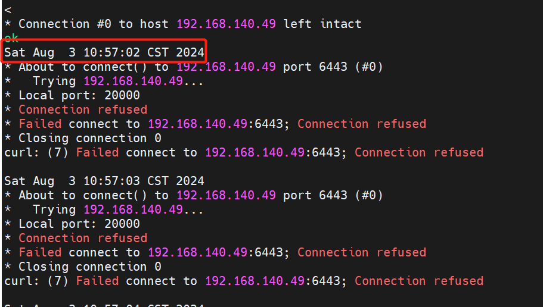
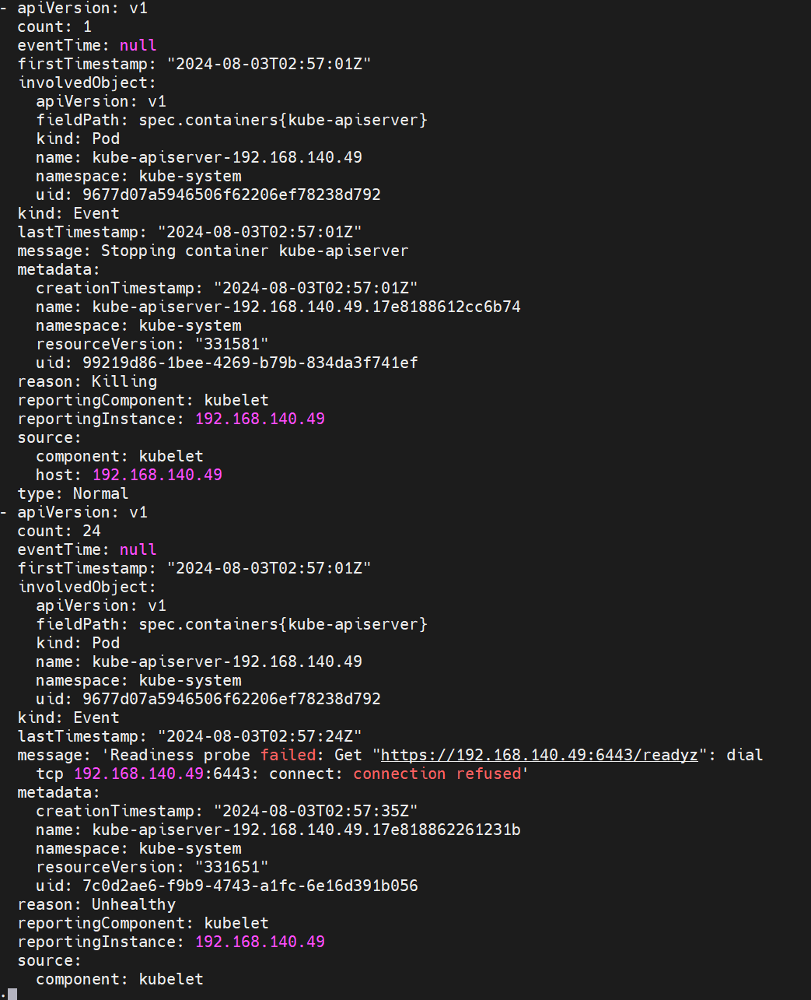
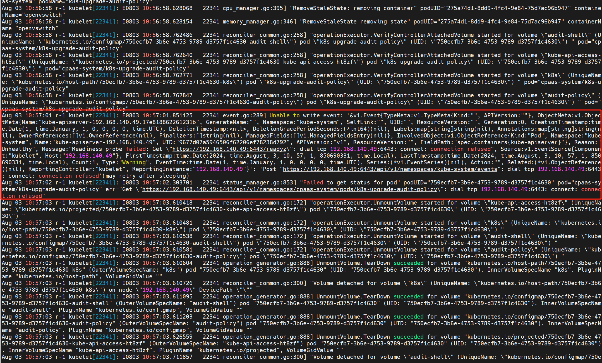
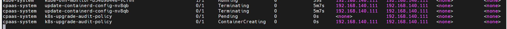

---
kind:
  - Troubleshooting
products:
  - Alauda Container Platform
  - Alauda DevOps
  - Alauda AI
  - Alauda Application Services
  - Alauda Service Mesh
  - Alauda Developer Portal
ProductsVersion:
  - 4.1.0,4.2.x
---
<!-- A type of document that involves encountering a fault, diagnosing it, performing root cause analysis, and providing solutions. -->

# 升级过程中 apiserver 重启

apiserver pod 重启 readiness probe /healthz 失败 升级完成后立即出现其他行为

## Cause

## Resolution

## [workaround]

## [Related Information]
**Screenshots**

- 6443 端口
- /healthz
- /livez
- liveness probe 配置参数(delay=10s timeout=15s period=10s failure=8)
- Kube-OVN
- Component: Kube-APIServer
- Page ID: 225968881
- Original Title: 升级过程中 apiserver 重启
