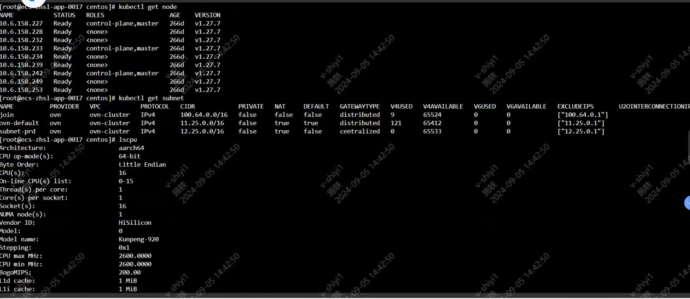
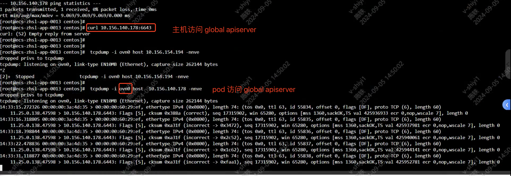

---
kind:
  - Troubleshooting
products:
  - Alauda Container Platform
  - Alauda DevOps
  - Alauda AI
  - Alauda Application Services
  - Alauda Service Mesh
  - Alauda Developer Portal
ProductsVersion:
  - 4.1.0,4.2.x
---
<!-- A type of document that involves encountering a fault, diagnosing it, performing root cause analysis, and providing solutions. -->

# 中化信息，容器网络访问集群外地址不通

容器无法访问集群外地址10.156.154.194:5236 节点10.6.158.253可访问该地址 其他节点无此问题

## Cause
- 物理网卡抓包无数据
- 节点iptables规则与其他节点一致但问题存在

## Resolution
- 联系iaas团队进行底层网络排查

## [workaround]

## [Related Information]
**Screenshots**

- Environment: CNI版本: kube-ovn 1.11; ACP版本: 3.14.1
- 10.156.154.194:5236
- kube-ovn
- 节点10.6.158.253
- Component: Kube-APIServer
- Page ID: 231116323
- Original Title: 中化信息，容器网络访问集群外地址不通
