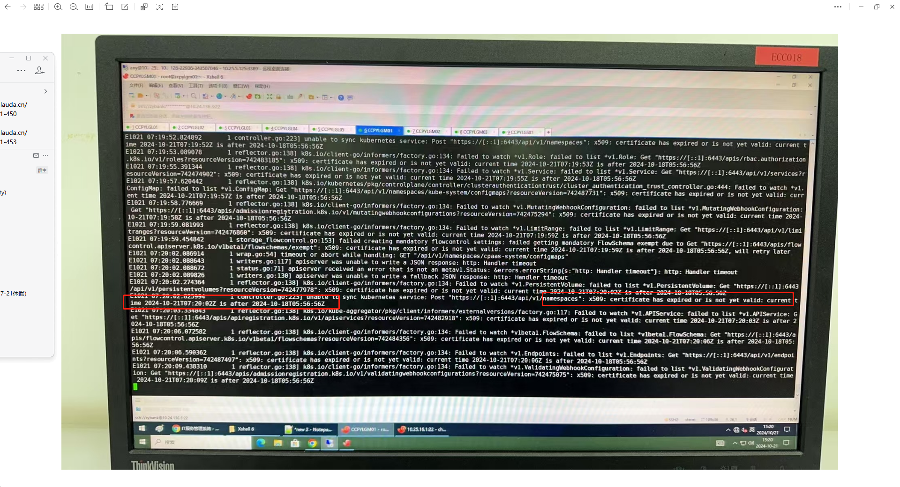

---
kind:
  - Troubleshooting
products:
  - Alauda Container Platform
  - Alauda DevOps
  - Alauda AI
  - Alauda Application Services
  - Alauda Service Mesh
  - Alauda Developer Portal
ProductsVersion:
  - 4.1.0,4.2.x
---
<!-- A type of document that involves encountering a fault, diagnosing it, performing root cause analysis, and providing solutions. -->

# 删除pod后pod无法新建

删除pod后pod无法新建 apiservice报证书错误

## Cause
- kube-apiserver内部交付的证书有效期1年到期

## Resolution
- 检查kube-apiserver容器运行时间，超过1年时手动删除重建

## [workaround]

## [Related Information]
**Screenshots**

- Environment: 通用
- kube-apiserver
- Component: Kube-APIServer
- Page ID: 240813829
- Original Title: 删除pod后pod无法新建-apiservice报错证书导致
