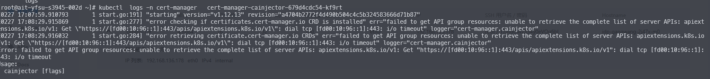

---
kind:
  - Troubleshooting
products:
  - Alauda Container Platform
  - Alauda DevOps
  - Alauda AI
  - Alauda Application Services
  - Alauda Service Mesh
  - Alauda Developer Portal
ProductsVersion:
  - 4.1.0,4.2.x
---
<!-- A type of document that involves encountering a fault, diagnosing it, performing root cause analysis, and providing solutions. -->

# IPv6 集群某个 Pod 无法连接 APIServer

Pod 连接 APIServer 超时 Pod 网卡抓包仅有 SYN 包无 SYN+ACK ICMP Reply 目的 IP 异常使用 LinkLocal 地址

## Cause
- 节点地址 6341::192:168:41:3/112 发生 IPv6 地址冲突(DAD 失败)

## Resolution
- 更换节点 IP 地址或释放被占用的 IP

## [workaround]

## [Related Information]
**Screenshots**

- Environment: ACP IPv6 单栈集群
- 6341::192:168:41:0/112
- fe80::/64
- DAD(重复地址检测)
- Kube-OVN CNI
- https://github.com/kubeovn/kube-ovn/pull/5042
- Component: Kube-APIServer
- Page ID: 268009940
- Original Title: IPv6 集群某个 Pod 无法连接 APIServer
