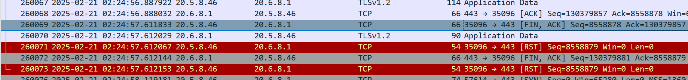

---
kind:
  - Troubleshooting
products:
  - Alauda Container Platform
  - Alauda DevOps
  - Alauda AI
  - Alauda Application Services
  - Alauda Service Mesh
  - Alauda Developer Portal
ProductsVersion:
  - 4.1.0,4.2.x
---
<!-- A type of document that involves encountering a fault, diagnosing it, performing root cause analysis, and providing solutions. -->

# Pod 偶现自动退出

Pod 自动退出 leader election 出现 lease 续期超时 HTTP 429 Too Many Requests 错误

## Cause
- apiserver 请求队列满导致 lease 续期请求被拒绝
- leader election 机制触发其他副本成为 leader

## Resolution

## [workaround]

## [Related Information]
**Screenshots**

- /apis/coordination.k8s.io/v1/namespaces/cpaas-system/leases/archon-controller-leader
- coordination.k8s.io/leases
- system:serviceaccount:cpaas-system:default
- queueset.go
- Component: Kube-APIServer
- Page ID: 272236901
- Original Title: Pod 偶现自动退出
