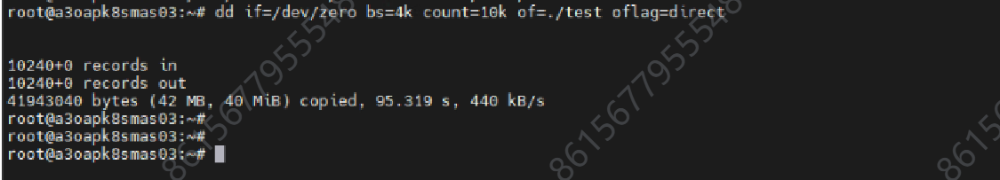

---
kind:
  - Troubleshooting
products:
  - Alauda Container Platform
  - Alauda DevOps
  - Alauda AI
  - Alauda Application Services
  - Alauda Service Mesh
  - Alauda Developer Portal
ProductsVersion:
  - 4.1.0,4.2.x
---
<!-- A type of document that involves encountering a fault, diagnosing it, performing root cause analysis, and providing solutions. -->

# 云平台故障告警

pod频繁健康检查失败发生重启 磁盘io升高 kube-apiserver日志存在etcd server timeout超时信息

## Cause
- 系统盘在周末存在定时任务导致写操作特别慢

## Resolution
- delete pod修复metis pod
- 执行crictl rm -f重启kube-apiserver、kube-controller、kube-scheduler
- 建议客户向iaas层确认系统盘定时任务

## [workaround]

## [Related Information]
**Screenshots**

- Environment: 3.18.1
- etcd
- kube-apiserver
- kube-controller
- kube-scheduler
- metis
- 系统盘
- Component: Kube-APIServer
- Page ID: 324174884
- Original Title: 基础架构-产品组件-云平台故障告警-113827
