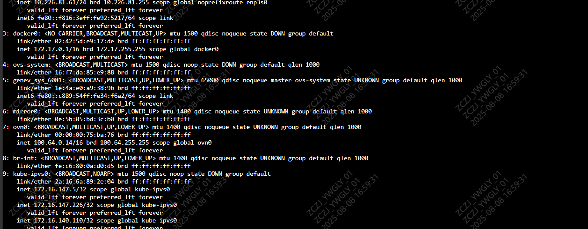

---
kind:
  - Troubleshooting
products:
  - Alauda Container Platform
  - Alauda DevOps
  - Alauda AI
  - Alauda Application Services
  - Alauda Service Mesh
  - Alauda Developer Portal
ProductsVersion:
  - 4.1.0,4.2.x
---
<!-- A type of document that involves encountering a fault, diagnosing it, performing root cause analysis, and providing solutions. -->

# coredns启动报错

Get "https://172.16.0.1:443/api/v1/services?limit=500&resourceVersion=0": dial tcp 172.16.0.1:443: i/o timeout 容器网络无法连通 apiserver

## Cause
- 子网 cidr 和 docker bridge 的网段冲突
- 虚拟机迁移导致底层网络迁移

## Resolution
- 对默认子网进行重新调整

## [workaround]
- 新增一个 ovn 子网段进行 IP 分配

## [Related Information]
**Screenshots**

- Environment: Alauda Container Platform 3.12.1 版本，麒麟操作系统
- 172.16.0.1:443
- ethtool -K enp3s0 tx off
- kylin - security - deamon
- tcpdump
- ovn 子网
- docker bridge
- Component: Kube-APIServer
- Page ID: 330465441
- Original Title: 容器平台-网络-coredns启动报错-114598
