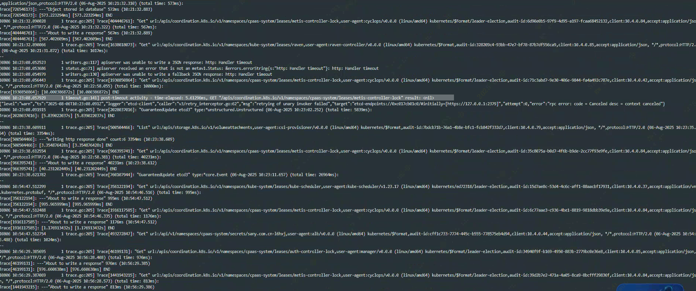

---
kind:
  - Troubleshooting
products:
  - Alauda Container Platform
  - Alauda DevOps
  - Alauda AI
  - Alauda Application Services
  - Alauda Service Mesh
  - Alauda Developer Portal
ProductsVersion:
  - 4.1.0,4.2.x
---
<!-- A type of document that involves encountering a fault, diagnosing it, performing root cause analysis, and providing solutions. -->

# 灾备环境平台组件重启原因排查

metis组件重启前存在报错 apiserver组件对应时间段出现异常日志

## Cause
- apiserver连接etcd不稳定导致接口调用异常

## Resolution
- 属于apiserver与etcd连接不稳定的偶发现象，后续自动恢复

## [workaround]

## [Related Information]
**Screenshots**

根据metis日志链接api接口失败，查看apiserver组件日志发现对应时间段apiserver存在异常信息，导致metis组件api接口清楚异常，触发重启
- Environment: 3.12.2
- metis
- apiserver
- etcd
- Component: Kube-APIServer
- Page ID: 330465775
- Original Title: 容器平台-灾备环境平台组件重启原因排查-114589
