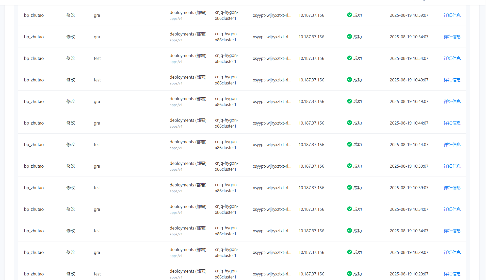
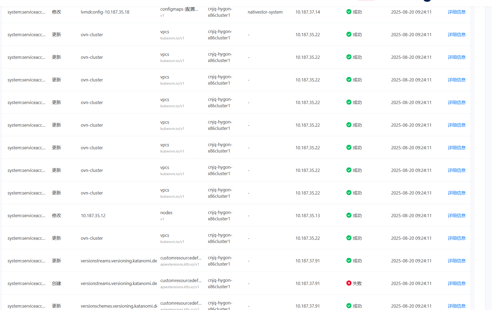
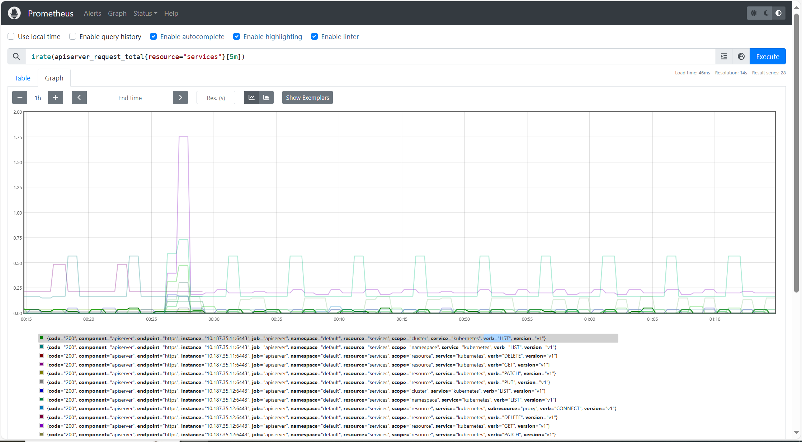
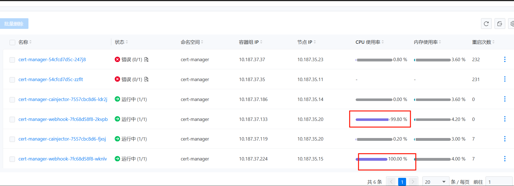
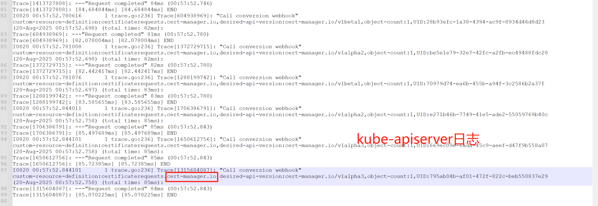
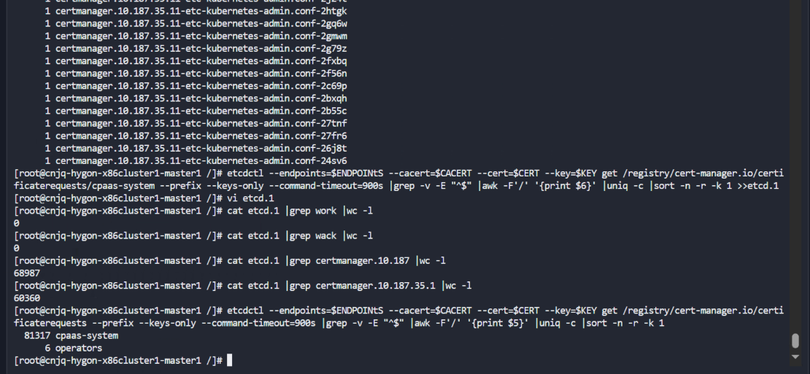

---
kind:
  - Troubleshooting
products:
  - Alauda Container Platform
  - Alauda DevOps
  - Alauda AI
  - Alauda Application Services
  - Alauda Service Mesh
  - Alauda Developer Portal
ProductsVersion:
  - 4.1.0,4.2.x
---
<!-- A type of document that involves encountering a fault, diagnosing it, performing root cause analysis, and providing solutions. -->

# apiserver pod内存使用量达到20G

apiserver pod内存使用量达到20G gra、test两个OAM应用频繁触发services资源的GET/更新操作 cert-manager-webhook的请求导致kube-apiserver负载升高

## Cause
- 道客云多集群管理纳管后触发资源频繁同步
- cert-manager服务异常导致大量certificaterequests资源残留

## Resolution
- 停止gra/test OAM应用：更新对应OAM组件replicas:0
- 删除残留certificaterequests资源：etcdctl --endpoints=$ENDPOINTS --cacert=$CACERT --cert=$CERT --key=$KEY del /registry/cert-manager.io/certificaterequests/cpaas-system/ --prefix
- 执行etcd数据压缩：etcd --endpoints=$ENDPOINTS --cacert=$CACERT --cert=$CERT --key=$KEY compact $rev
- 执行etcd空间整理：/usr/bin/etcdctl --endpoints=$ENDPOINTS --cacert=$CACERT --cert=$CERT --key=$KEY defrag
- 重启kube-apiserver pod

## [workaround]

## [Related Information]
**Screenshots**

- Environment: 3.14.2
- OAM应用
- cert-manager-webhook
- etcd
- certificaterequests资源
- etcdctl --endpoints=https://$HOST:2379
- /etc/kubernetes/pki/etcd/证书路径
- Component: Kube-APIServer
- Page ID: 333316746
- Original Title: 基础架构-apiserver pod内存使用量达到20G-115624
