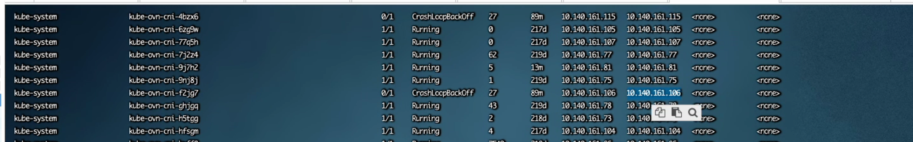
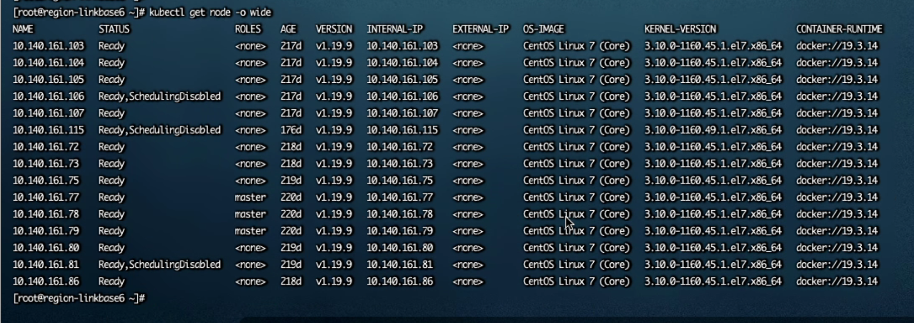
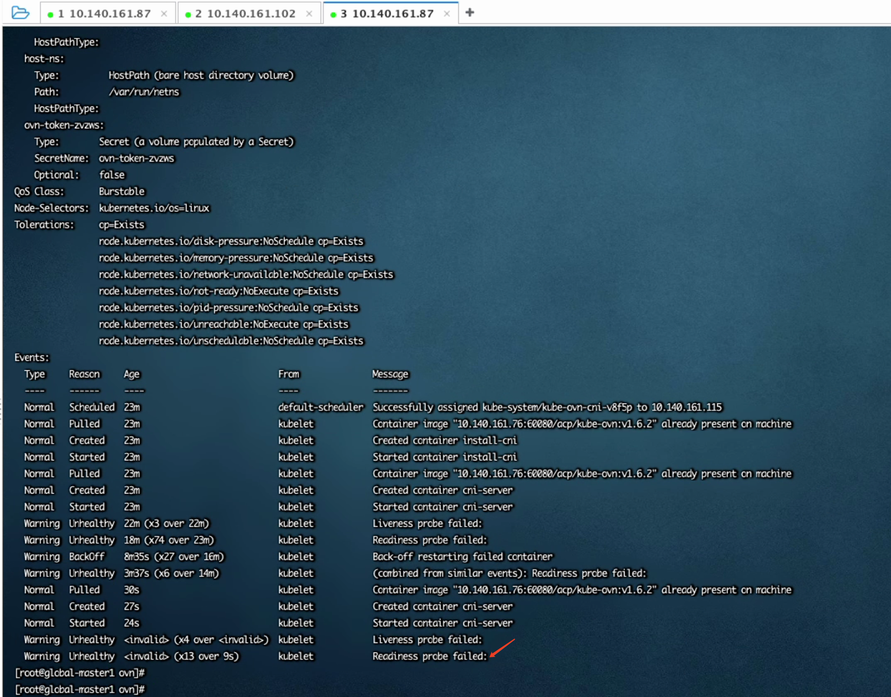
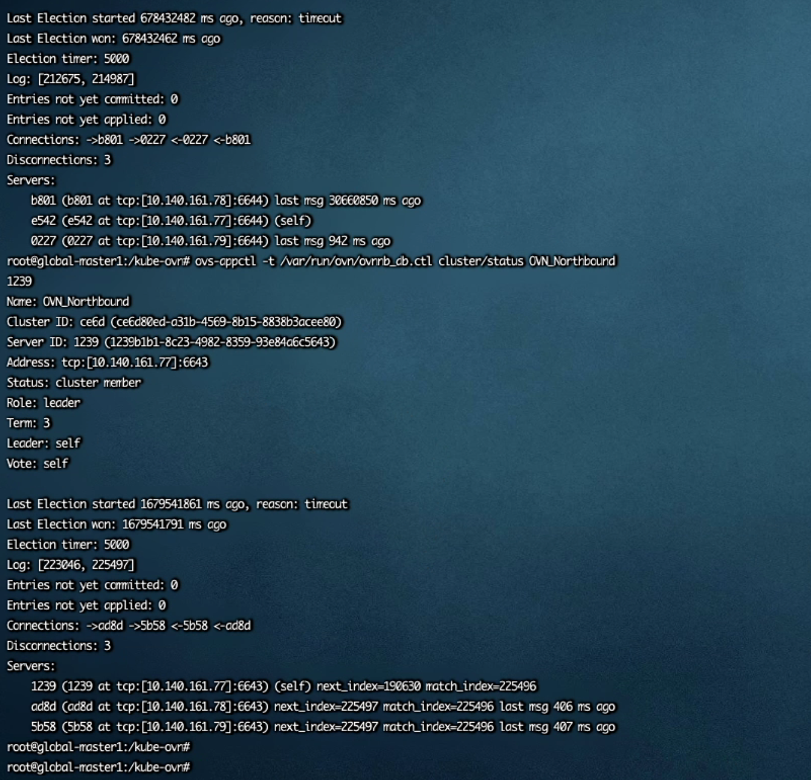
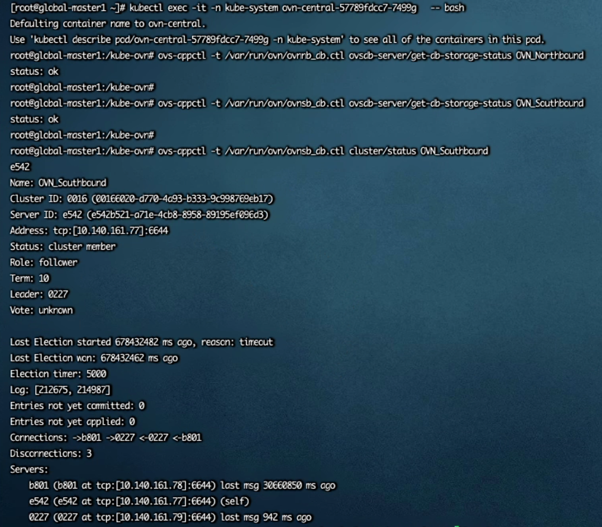
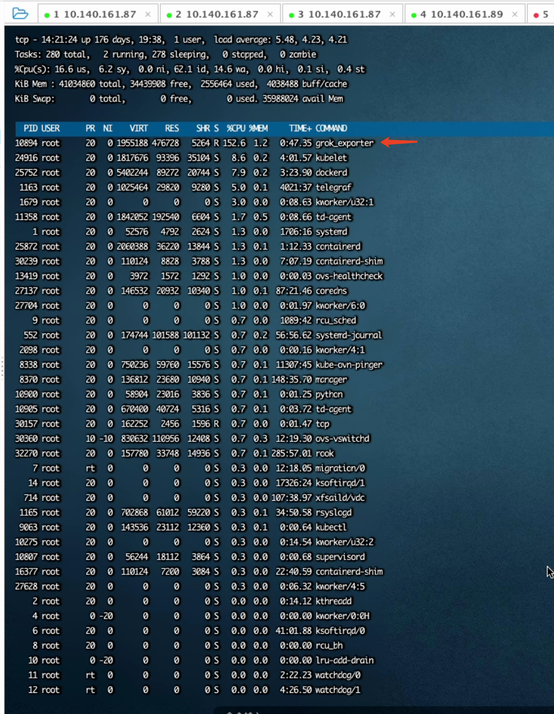
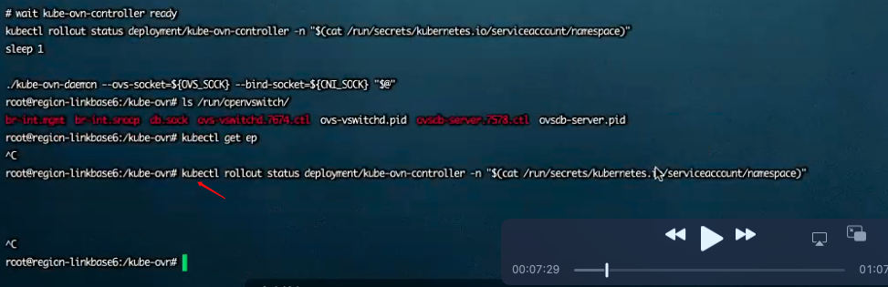
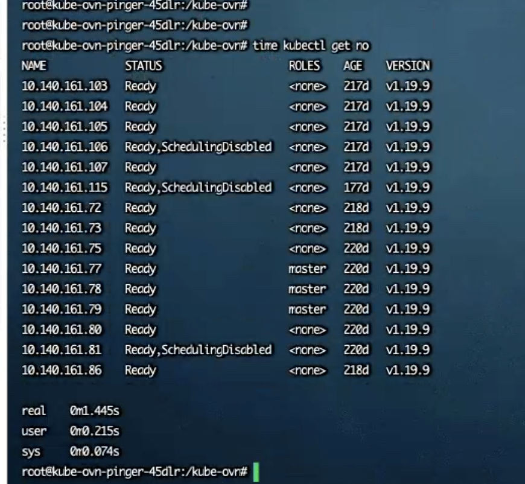
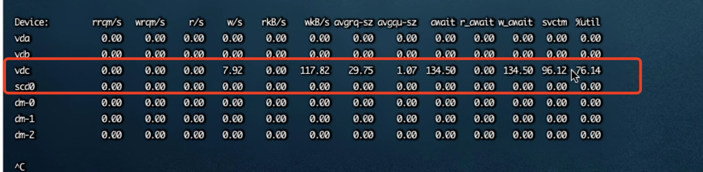

---
kind:
  - Troubleshooting
products:
  - Alauda Container Platform
  - Alauda DevOps
  - Alauda AI
  - Alauda Application Services
  - Alauda Service Mesh
  - Alauda Developer Portal
ProductsVersion:
  - 4.1.0,4.2.x
---
<!-- A type of document that involves encountering a fault, diagnosing it, performing root cause analysis, and providing solutions. -->

# 20220610

kube-ovn-cni pod状态异常 节点因压力大被标记为不可调度 pod describe显示readiness和liveness检查失败

## Cause
- 磁盘I/O性能问题导致apiserver访问超时

## Resolution
- 修改kube-ovn-cni DaemonSet配置，删除livenessProbe检查

## [workaround]

## [Related Information]
**Screenshots**

- kube-ovn-cni DaemonSet
- livenessProbe
- readinessProbe
- kube-proxy
- apiserver
- NB/SB数据库
- Component: Kube-Proxy
- Page ID: 115532961
- Original Title: 20220610-国电投底座 kube-ovn-cni 无法正常启动
