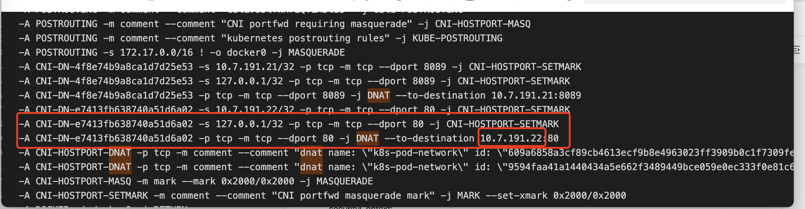

---
kind:
  - Troubleshooting
products:
  - Alauda Container Platform
  - Alauda DevOps
  - Alauda AI
  - Alauda Application Services
  - Alauda Service Mesh
  - Alauda Developer Portal
ProductsVersion:
  - 4.1.0,4.2.x
---
<!-- A type of document that involves encountering a fault, diagnosing it, performing root cause analysis, and providing solutions. -->

# 3.0.5

alb 80端口不通 主机上telnet本机80端口不通 telnet localhost 80正常但127.0.0.1和本机IP 80不通

## Cause
- 主机存在其他应用占用80端口

## Resolution
- 删除占用主机80端口的业务应用
- 重启kube-proxy组件

## [workaround]

## [Related Information]
**Screenshots**
****

- Environment: 3.0.5
- 主机80端口
- kube-proxy
- iptables
- alb组件
- Component: Kube-Proxy
- Page ID: 119086054
- Original Title: 3.0.5-容器平台-alb 80端口不通
