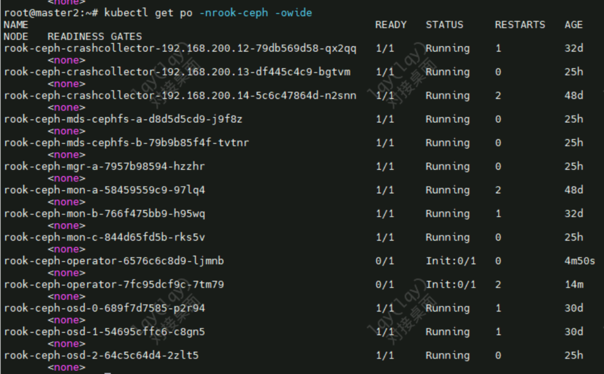
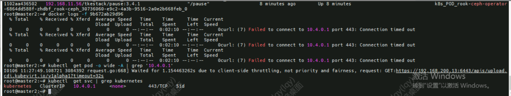
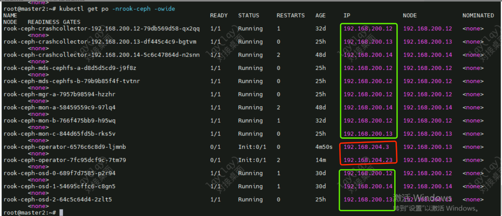
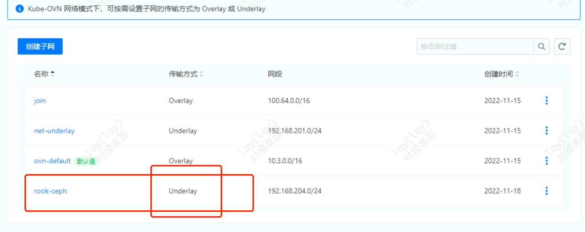

---
kind:
  - Troubleshooting
products:
  - Alauda Container Platform
  - Alauda DevOps
  - Alauda AI
  - Alauda Application Services
  - Alauda Service Mesh
  - Alauda Developer Portal
ProductsVersion:
  - 4.1.0,4.2.x
---
<!-- A type of document that involves encountering a fault, diagnosing it, performing root cause analysis, and providing solutions. -->

# underlay的ns无法连通至overlay网段

underlay的ns无法连通至overlay网段 rook-ceph-operator和rook-discover异常 rook-ceph-controller处于init状态，报错连不上kubernetes的svc

## Cause
- 192.168.204.1 underlay网关设备未开通至10.4.0.0/16的svc网段
- 服务器更换交换机后未配置underlay到10.4.0.0/16与10.3.0.0/16的网络策略

## Resolution
- 配置underlay网关到10.4.0.0/16和10.3.0.0/16的网络策略

## [workaround]

## [Related Information]
**Screenshots**

- Environment: TKE 3.4以上
- rook-ceph-operator
- rook-discover
- rook-ceph-controller
- ovn
- kube-proxy
- underlay模式
- 10.4.0.0/16
- 10.3.0.0/16
- Component: Kube-Proxy
- Page ID: 140824772
- Original Title: underlay的ns无法连通至overlay网段
