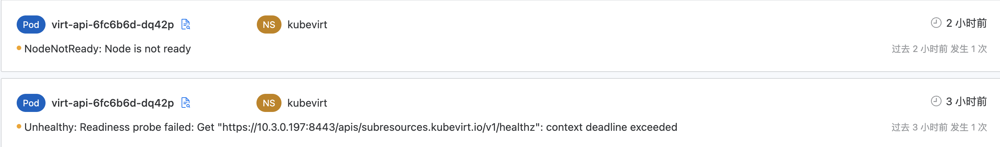

---
kind:
  - Troubleshooting
products:
  - Alauda Container Platform
  - Alauda DevOps
  - Alauda AI
  - Alauda Application Services
  - Alauda Service Mesh
  - Alauda Developer Portal
ProductsVersion:
  - 4.1.0,4.2.x
---
<!-- A type of document that involves encountering a fault, diagnosing it, performing root cause analysis, and providing solutions. -->

# Pod 无法访问 Service IP：Connection refused

apiserver 无法通过 Service IP 访问 webhook，报错 connection refused 通过 Pod IP 访问正常 IPVS real server 的 weight 为 0（正常应为 1）

## Cause
- kube-proxy 在 IPVS 模式下存在 bug（#108319），节点短暂 NotReady 后恢复时未正确更新 real server 权重
- kube-proxy 重启后未正确处理 graceful delete 队列中的条目

## Resolution
- 删除并重建 service endpoint 对应的 Pod
- 升级 Kubernetes 到 v1.26.0 或应用修复补丁 #111635

## [workaround]

## [Related Information]
**Screenshots**

- Environment: Kubernetes v1.25.11，kube-proxy 使用 ipvs 模式
- kube-proxy
- IPVS
- iptables TRACE 规则
- Service IP 10.4.169.68:443
- Pod IP 10.3.0.197:8443
- KUBE-SERVICES 链
- KUBE-MARK-MASQ 链
- Component: Kube-Proxy
- Page ID: 152660463
- Original Title: Pod 无法访问 Service IP：Connection refused
