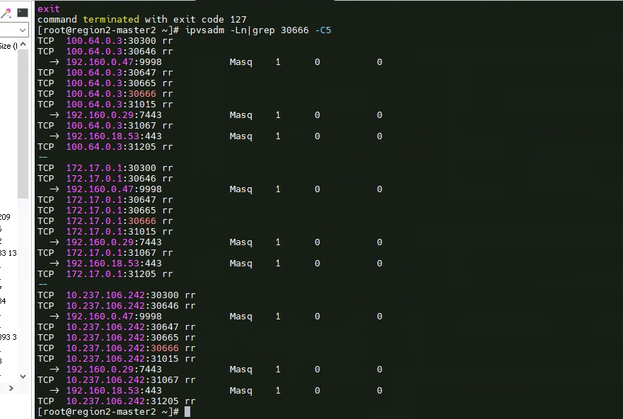
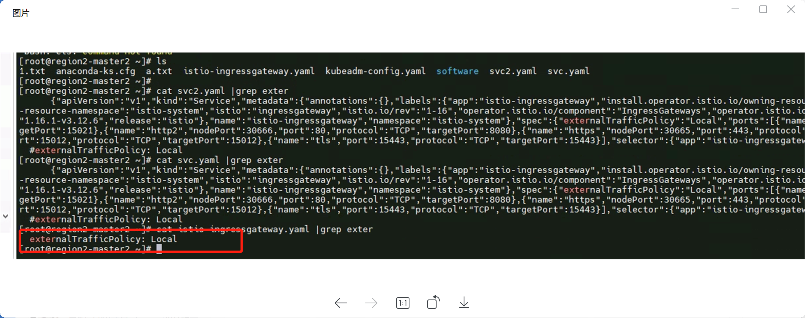

---
kind:
  - Troubleshooting
products:
  - Alauda Container Platform
  - Alauda DevOps
  - Alauda AI
  - Alauda Application Services
  - Alauda Service Mesh
  - Alauda Developer Portal
ProductsVersion:
  - 4.1.0,4.2.x
---
<!-- A type of document that involves encountering a fault, diagnosing it, performing root cause analysis, and providing solutions. -->

# nodeport service ipvs规则无后端

节点上某个Node Port Service的ipvs没有后端规则

## Cause
- Service配置了externalTrafficPolicy: Local，导致非Pod所在节点未添加后端规则

## Resolution
- 删除Service的externalTrafficPolicy: Local配置，使用默认的Cluster模式

## [workaround]

## [Related Information]
**Screenshots**

- Environment: 麒麟操作系统，具体Kubernetes版本和内核信息未提供
- externalTrafficPolicy
- kube-proxy
- ipvs
- iptables
- NodePort Service
- Component: Kube-Proxy
- Page ID: 163079063
- Original Title: nodeport service ipvs规则无后端
