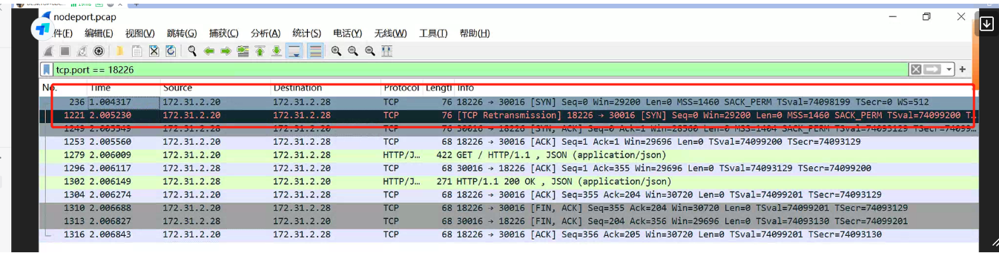
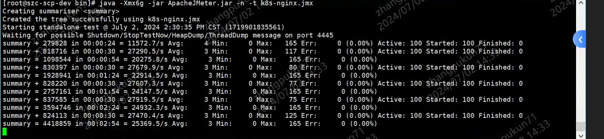

---
kind:
  - Troubleshooting
products:
  - Alauda Container Platform
  - Alauda DevOps
  - Alauda AI
  - Alauda Application Services
  - Alauda Service Mesh
  - Alauda Developer Portal
ProductsVersion:
  - 4.1.0,4.2.x
---
<!-- A type of document that involves encountering a fault, diagnosing it, performing root cause analysis, and providing solutions. -->

# 深圳智慧城市压测问题访问service IP时性能很低，直接访问Pod IP性能正常。

访问Service IP（NodePort/ClusterIP）时性能差，直接访问Pod IP性能正常 访问Service时客户端CPU使用率低，直接访问容器IP时CPU使用率达到100% 客户端使用3万+源端口发起短连接，SYNC报文频繁重传

## Cause
- IPVS模式处理大量短连接时InActConn堆积导致性能下降
- IPVS在清理非活跃连接时存在资源竞争

## Resolution
- 修改压测方式使用长连接替代短连接

## [workaround]
- 将kube-proxy模式切换为iptables：kube-proxy --proxy-mode=iptables

## [Related Information]
**Screenshots**

- Environment: 内核版本：3.10
- ipvs
- kube-proxy
- conntrack
- NodePort
- ClusterIP
- InActConn
- SYNC重传
- Component: Kube-Proxy
- Page ID: 219089214
- Original Title: 深圳智慧城市压测问题访问service IP时性能很低，直接访问Pod IP性能正常。
