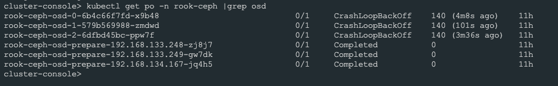
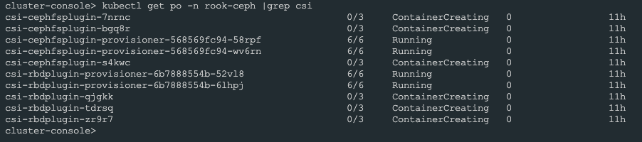
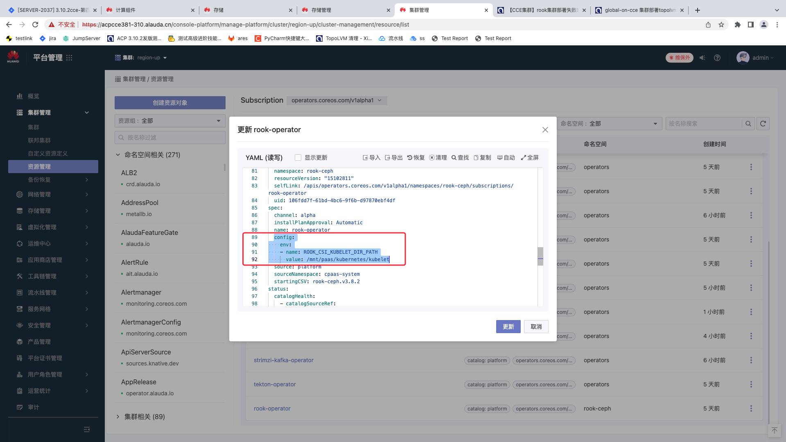

---
kind:
  - Troubleshooting
products:
  - Alauda Container Platform
  - Alauda DevOps
  - Alauda AI
  - Alauda Application Services
  - Alauda Service Mesh
  - Alauda Developer Portal
ProductsVersion:
  - 4.1.0,4.2.x
---
<!-- A type of document that involves encountering a fault, diagnosing it, performing root cause analysis, and providing solutions. -->

# 【CCE集群】rook集群部署失败的解决方案

osd 运行状态为 CrashLoopBackOff csi pod 一直处于 ContainerCreating 状态 csi 的daemonset 的 pod 报错，提示路径不存在

## Cause
- CCE 集群节点的 failure-domain.beta.kubernetes.io/zone 标签值为空，导致 osd 的 crush-location 参数包含 'zone=' 部分
- CCE 集群 kubelet 默认路径非 /var/lib/kubelet，rook 未适配该路径
- kube-controller-manager 参数禁用 attachdetach 控制器，且 kubelet 的 enableControllerAttachDetach 配置为 false

## Resolution
- 修改 osd deployment 的 crush-location 参数，移除 'zone=' 部分
- 在 rook-operator 的 Subscription 资源中配置 ROOK_CSI_KUBELET_DIR_PATH 环境变量为实际 kubelet 路径（如 /mnt/paas/kubernetes/kubelet）
- 修改 kube-controller-manager.manifest 文件，去除 --controllers 中的 -attachdetach，修改 kubelet_config.yaml 的 enableControllerAttachDetach 为 true，并重启 kubelet

## [workaround]

## [Related Information]
**Screenshots**

- Environment: acp-3.6, acp-3.10.2, CCE-22.3, CCE-22.6
- failure-domain.beta.kubernetes.io/zone
- osd deployment 的 crush-location 参数
- rook-operator Subscription 资源
- ROOK_CSI_KUBELET_DIR_PATH
- kube-controller-manager.manifest
- kubelet_config.yaml
- --controllers
- enableControllerAttachDetach
- Component: Kubelet
- Page ID: 101662822
- Original Title: 【CCE集群】rook集群部署失败的解决方案
