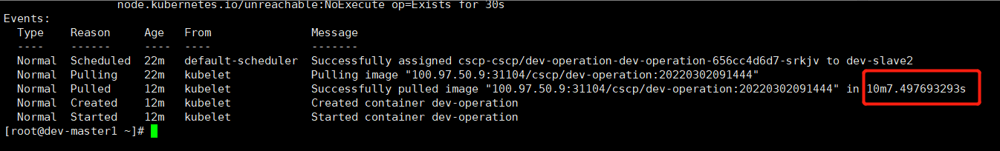

---
kind:
  - Troubleshooting
products:
  - Alauda Container Platform
  - Alauda DevOps
  - Alauda AI
  - Alauda Application Services
  - Alauda Service Mesh
  - Alauda Developer Portal
ProductsVersion:
  - 4.1.0,4.2.x
---
<!-- A type of document that involves encountering a fault, diagnosing it, performing root cause analysis, and providing solutions. -->

# 平台创建应用时，镜像拉取速度慢

创建应用时镜像拉取耗时10分钟 节点单独拉取镜像速度正常 kubelet日志显示存在阻塞拉取的问题镜像仓库

## Cause
- 问题镜像仓库导致拉取队列阻塞
- 单镜像最大拉取超时时间为10分钟

## Resolution
- 修复问题镜像仓库状态
- 更换镜像名称或使用其他镜像

## [workaround]

## [Related Information]
**Screenshots**

- Environment: acp 3.x
- kubelet
- 镜像仓库
- Pod/Deployment
- Component: Kubelet
- Page ID: 112034022
- Original Title: 平台创建应用时，镜像拉取速度慢
