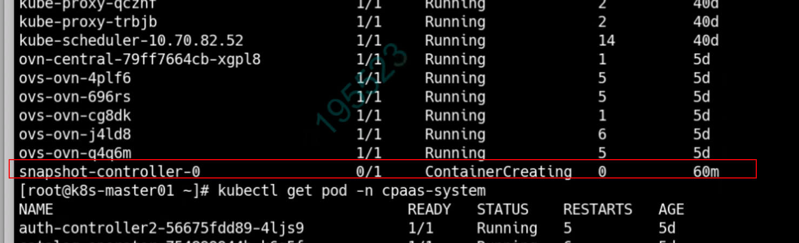
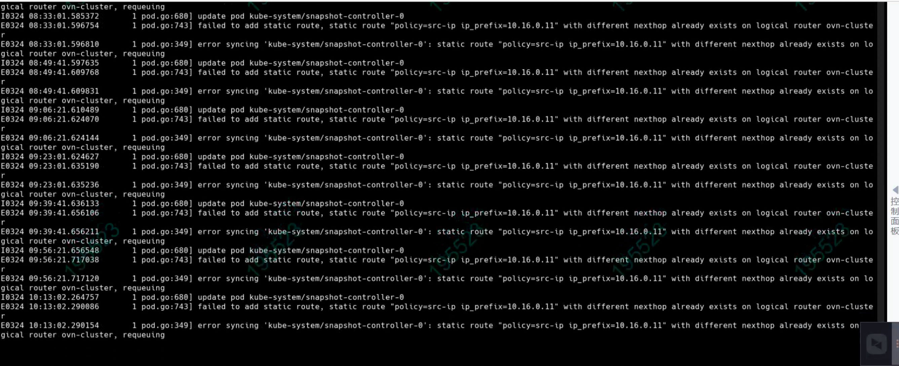

---
kind:
  - Troubleshooting
products:
  - Alauda Container Platform
  - Alauda DevOps
  - Alauda AI
  - Alauda Application Services
  - Alauda Service Mesh
  - Alauda Developer Portal
ProductsVersion:
  - 4.1.0,4.2.x
---
<!-- A type of document that involves encountering a fault, diagnosing it, performing root cause analysis, and providing solutions. -->

# Pod 处于 containerCreating 状态，事件提示 etcdserver: request is too large

Pod 处于 containerCreating 状态 事件提示 etcdserver: request is too large kube-ovn-controller 日志提示静态路由冲突: static route with different nexthop already exists on logical router ovn-cluster

## Cause
- kube-ovn v1.8.2 statefulset pod 迁移时未正确清理旧路由导致冲突
- kube-ovn-cni 重复更新 IP CR 时未去重导致数据膨胀

## Resolution
- kubectl delete ip kube-system-snapshot-controller-0
- kubectl ko nbctl --policy=src-ip lr-route-del ovn-cluster 10.16.0.11
- 重启受影响的 Pod
- 升级到 kube-ovn v1.8.3 版本

## [workaround]

## [Related Information]
**Screenshots**

- Environment: Kube-OVN v1.8.2
- kube-ovn-controller
- kube-ovn-cni
- etcd
- ip CRD
- ovn-cluster 逻辑路由
- src-ip 路由策略
- 10.16.0.11
- Component: Kubelet
- Page ID: 112041079
- Original Title: Pod 处于 containerCreating 状态，事件提示 etcdserver: request is too large
