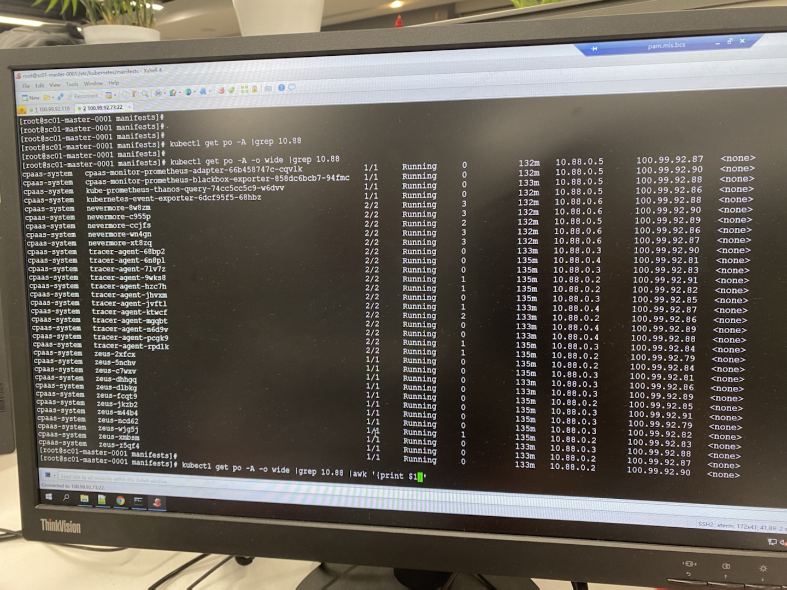
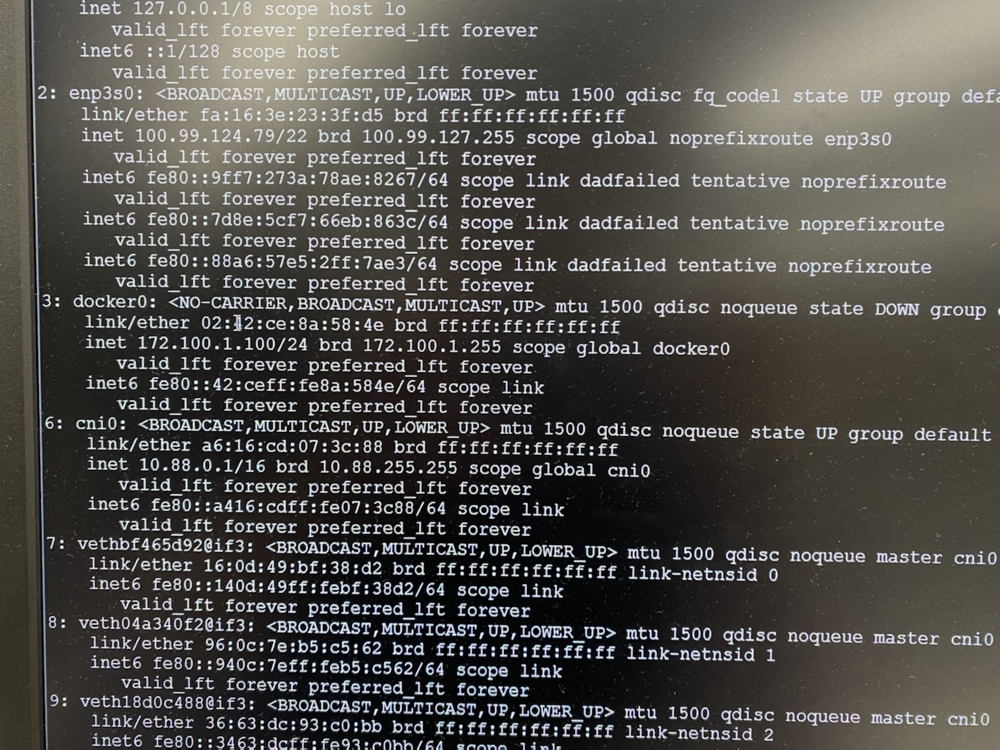
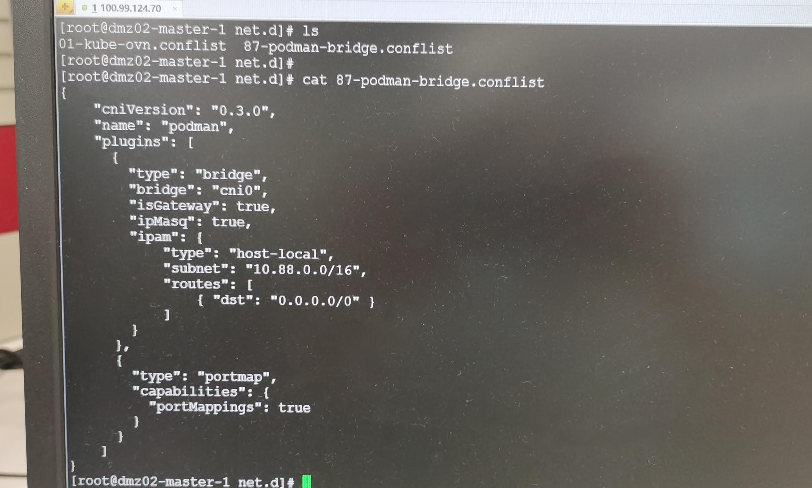

---
kind:
  - Troubleshooting
products:
  - Alauda Container Platform
  - Alauda DevOps
  - Alauda AI
  - Alauda Application Services
  - Alauda Service Mesh
  - Alauda Developer Portal
ProductsVersion:
  - 4.1.0,4.2.x
---
<!-- A type of document that involves encountering a fault, diagnosing it, performing root cause analysis, and providing solutions. -->

# 新部署集群节点上出现 cni0 网桥，并且启动容器不在创建集群的 CIDR 内

Pod未使用创建集群时指定的CIDR 主机上存在cni0网桥

## Cause
- 机器模板预装podman导致CNI配置冲突

## Resolution
- 卸载podman: yum remove podman
- 删除CNI配置文件: rm /etc/cni/net.d/*podman*
- 重启kubelet: systemctl restart kubelet
- 重启错误IP的Pod: kubectl delete pod <pod-name>

## [workaround]

## [Related Information]
**Screenshots**

- Environment: 长沙银行新部署的Kubernetes集群
- /etc/cni/net.d
- cni0
- podman
- kubelet
- Component: Kubelet
- Page ID: 112050319
- Original Title: 新部署集群节点上出现 cni0 网桥，并且启动容器不在创建集群的 CIDR 内
