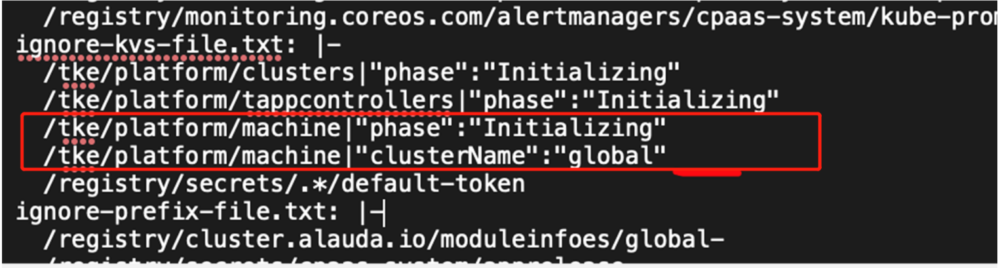

---
kind:
  - Troubleshooting
products:
  - Alauda Container Platform
  - Alauda DevOps
  - Alauda AI
  - Alauda Application Services
  - Alauda Service Mesh
  - Alauda Developer Portal
ProductsVersion:
  - 4.1.0,4.2.x
---
<!-- A type of document that involves encountering a fault, diagnosing it, performing root cause analysis, and providing solutions. -->

# 容灾环境

集群添加业务节点失败，添加报错提示证书错误

## Cause
- etcd-sync配置错误导致主备集群controller资源竞争
- 错误配置的machine资源同步规则

## Resolution
- 修改etcd-sync-ignore-text配置为/tke/platform/machines|"phase":"Initializing"|"clusterName":"global"
- 重启etcd-mirror服务
- 建议删除临时导证书方式添加的节点并重新添加

## [workaround]
- 将master节点kubelet.crt和kubelet.key文件拷贝到node节点

## [Related Information]
**Screenshots**

- Environment: TKE 3.6.1 容灾环境
- etcd-sync-ignore-text
- machine资源
- controller
- etcd-mirror
- Component: Kubelet
- Page ID: 112055490
- Original Title: 容灾环境-集群添加业务节点失败
