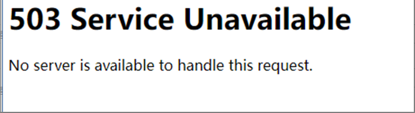

---
kind:
  - Troubleshooting
products:
  - Alauda Container Platform
  - Alauda DevOps
  - Alauda AI
  - Alauda Application Services
  - Alauda Service Mesh
  - Alauda Developer Portal
ProductsVersion:
  - 4.1.0,4.2.x
---
<!-- A type of document that involves encountering a fault, diagnosing it, performing root cause analysis, and providing solutions. -->

# 2.9

访问平台返回503 大量Pod被驱逐 磁盘空间满

## Cause
- metis组件阻塞

## Resolution
- 停止metis服务

## [workaround]

## [Related Information]
**Screenshots**

- Environment: 2.9
- metis
- kube-proxy
- flannel
- galaxy
- Component: Kubelet
- Page ID: 115513021
- Original Title: 2.9-平台访问界面返回503
