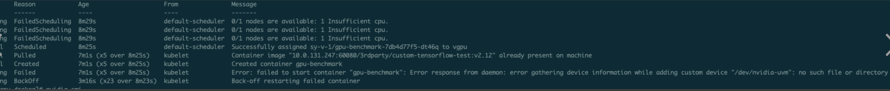

---
kind:
  - Troubleshooting
products:
  - Alauda Container Platform
  - Alauda DevOps
  - Alauda AI
  - Alauda Application Services
  - Alauda Service Mesh
  - Alauda Developer Portal
ProductsVersion:
  - 4.1.0,4.2.x
---
<!-- A type of document that involves encountering a fault, diagnosing it, performing root cause analysis, and providing solutions. -->

# GPU应用启动失败

GPU应用启动失败，事件报错提示模块未加载

## Cause
- GPU节点重启后nvidia相关内核模块未自动加载

## Resolution
- 在kubelet.service的[Service]段添加：ExecStartPre=/bin/bash -c 'modprobe nvidia-uvm;nvidia-modprobe -u -c=0'
- 执行 systemctl daemon-reload
- 执行 systemctl restart kubelet

## [workaround]

## [Related Information]
**Screenshots**

- Environment: GPU节点运行kubelet服务
- kubelet.service
- nvidia-uvm
- nvidia-modprobe
- /etc/systemd/system/kubelet.service
- Component: Kubelet
- Page ID: 115515947
- Original Title: GPU应用启动失败
