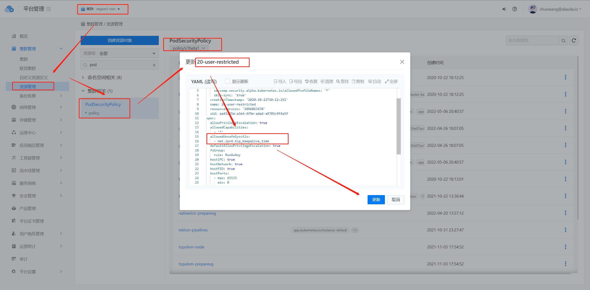

---
kind:
  - Troubleshooting
products:
  - Alauda Container Platform
  - Alauda DevOps
  - Alauda AI
  - Alauda Application Services
  - Alauda Service Mesh
  - Alauda Developer Portal
ProductsVersion:
  - 4.1.0,4.2.x
---
<!-- A type of document that involves encountering a fault, diagnosing it, performing root cause analysis, and providing solutions. -->

# 业务应用pod如何设置sysctl内核参数（废弃）

无法修改非安全sysctl参数 需要容器特权模式以应用某些参数

## Cause
- 未将sysctl参数加入kubelet的allowed-unsafe-sysctls列表
- 未启用容器privileged模式

## Resolution
- 修改kubelet的--allowed-unsafe-sysctls参数，包含目标sysctl命名空间
- 在Pod的securityContext.sysctls中指定参数
- 启用容器的privileged: true模式
- 执行systemctl daemon-reload && systemctl restart kubelet重启kubelet

## [workaround]

## [Related Information]
**Screenshots**

- Environment: 通用
- /var/lib/kubelet/kubeadm-flags.env
- securityContext
- sysctls
- privileged
- net.ipv4.tcp_tw_reuse
- net.core.somaxconn
- Component: Kubelet
- Page ID: 115527649
- Original Title: 业务应用pod如何设置sysctl内核参数（废弃）
