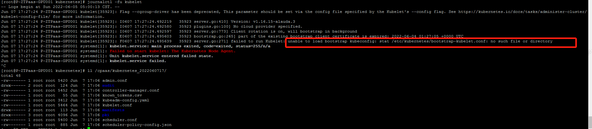

---
kind:
  - Troubleshooting
products:
  - Alauda Container Platform
  - Alauda DevOps
  - Alauda AI
  - Alauda Application Services
  - Alauda Service Mesh
  - Alauda Developer Portal
ProductsVersion:
  - 4.1.0,4.2.x
---
<!-- A type of document that involves encountering a fault, diagnosing it, performing root cause analysis, and providing solutions. -->

# kubelet启动失败

kubelet启动失败，报错unable to load bootstrap kubeconfig: stat /etc/kubernetes/bootstrap-kubelet.conf: no such file or directory

## Cause
- 断电导致kubelet认证缓存丢失，且bootstrap-kubelet.conf文件在首次部署启动后已被自动清理

## Resolution
- cd /etc/kubernets
- cp kubelet.conf bootstrap-kubelet.conf
- systemctl restart kubelet

## [workaround]

## [Related Information]
**Screenshots**

- Environment: 3.x
- /etc/kubernetes/bootstrap-kubelet.conf
- kubelet.conf
- kubelet
- kube-apiserver
- Component: Kubelet
- Page ID: 115529904
- Original Title: kubelet启动失败
