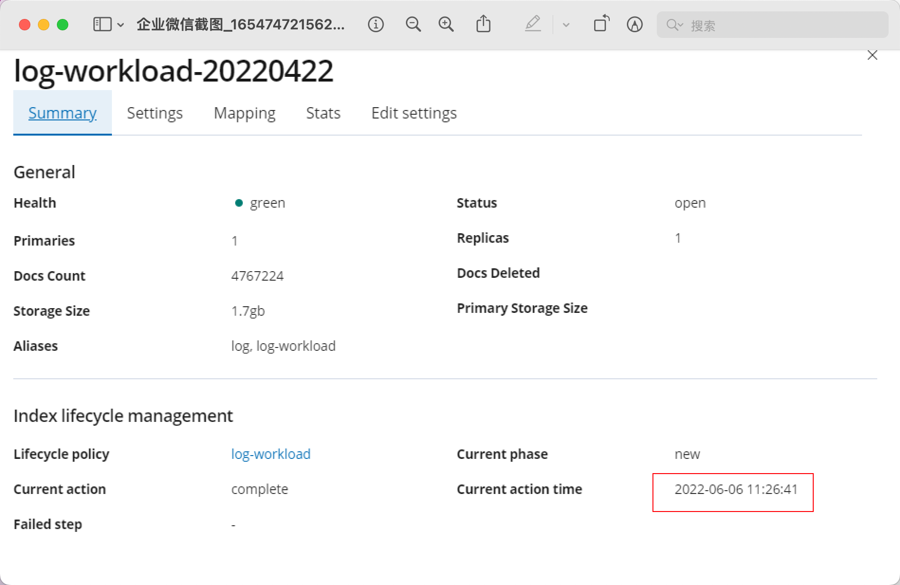
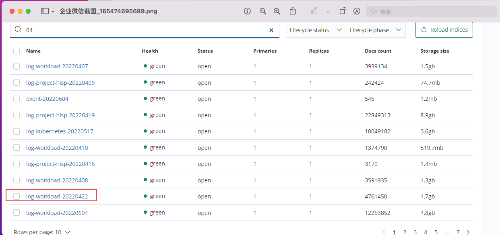
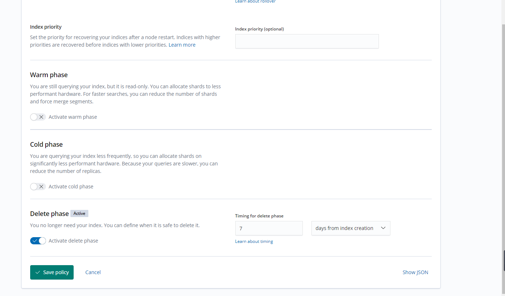
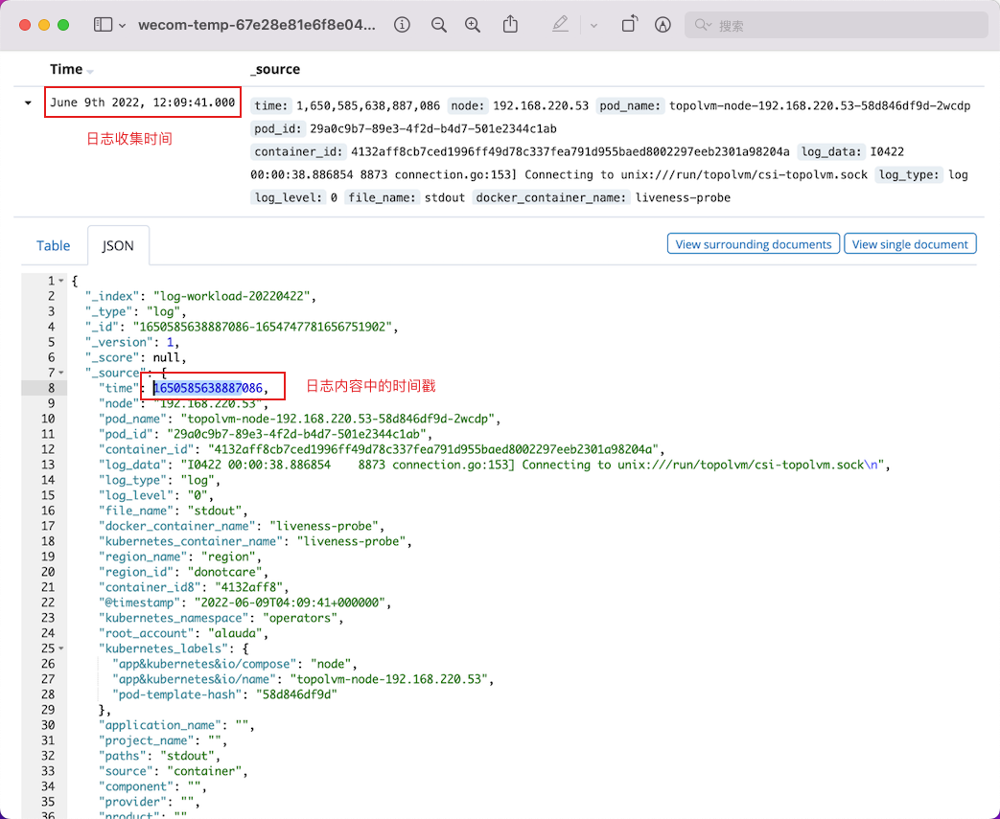
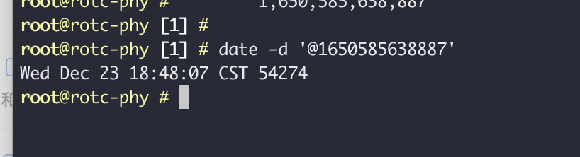

---
kind:
  - Troubleshooting
products:
  - Alauda Container Platform
  - Alauda DevOps
  - Alauda AI
  - Alauda Application Services
  - Alauda Service Mesh
  - Alauda Developer Portal
ProductsVersion:
  - 4.1.0,4.2.x
---
<!-- A type of document that involves encountering a fault, diagnosing it, performing root cause analysis, and providing solutions. -->

# ES日志自动轮询异常问题

七天前的索引未被清理 索引内容中的日志时间（4月22日）早于索引创建时间（6月6日）

## Cause
- 索引名称基于日志事件时间戳而非收集时间（例如log-xxx0422）
- 日志收集组件会扫描已退出容器的日志文件导致重复收集

## Resolution
- 添加定时清理退出容器任务：docker system prune -f &>/dev/null
- 执行脚本删除索引名称日期超过7天的索引（通过curl -XDELETE操作）

## [workaround]

## [Related Information]
**Screenshots**

- Environment: 3.0.x, 3.4.x, 3.6.x
- 索引生命周期管理（ILM）
- 日志收集组件
- crontab
- ES_PASSWORD
- log-xxx0422
- /_cat/indices
- Component: Kubelet
- Page ID: 115535708
- Original Title: ES日志自动轮询异常问题
