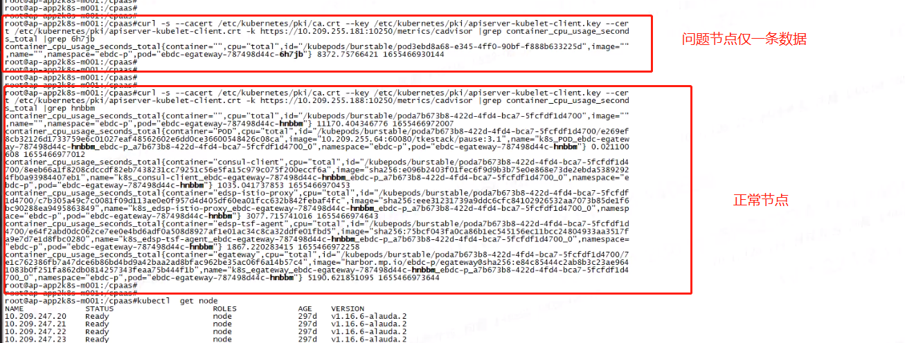

---
kind:
  - Troubleshooting
products:
  - Alauda Container Platform
  - Alauda DevOps
  - Alauda AI
  - Alauda Application Services
  - Alauda Service Mesh
  - Alauda Developer Portal
ProductsVersion:
  - 4.1.0,4.2.x
---
<!-- A type of document that involves encountering a fault, diagnosing it, performing root cause analysis, and providing solutions. -->

# 3.4.2

容器组监控页面数据加载失败 Prometheus中缺少容器信息 异常节点上的容器监控数据缺失

## Cause
- kubelet的bug导致cAdvisor无法收集pod数据

## Resolution
- 重启异常节点kubelet服务

## [workaround]

## [Related Information]
**Screenshots**

- Environment: 3.4.2
- cAdvisor
- kubelet
- Prometheus
- Component: Kubelet
- Page ID: 119086034
- Original Title: 3.4.2-可视化运维-部分容器无监控数据
