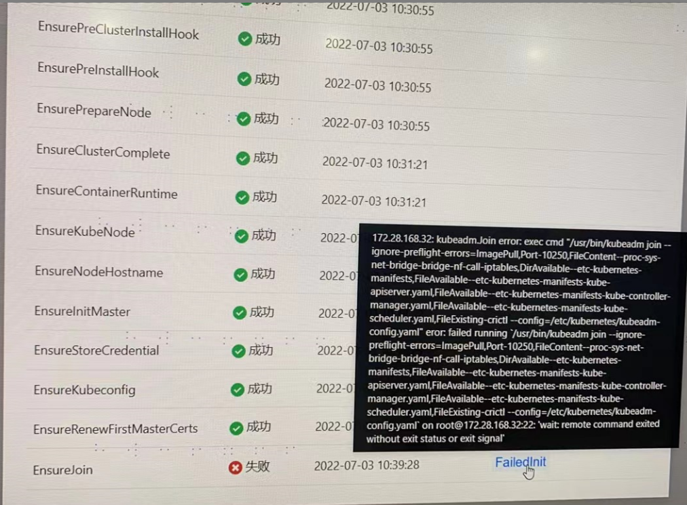

---
kind:
  - Troubleshooting
products:
  - Alauda Container Platform
  - Alauda DevOps
  - Alauda AI
  - Alauda Application Services
  - Alauda Service Mesh
  - Alauda Developer Portal
ProductsVersion:
  - 4.1.0,4.2.x
---
<!-- A type of document that involves encountering a fault, diagnosing it, performing root cause analysis, and providing solutions. -->

# 新增业务集群报错

kubelet服务无法启动 部分文件缺失错误 节点间22端口连接失败

## Cause
- kubelet服务异常
- 关键文件缺失
- 节点间SSH通信异常

## Resolution
- 重新部署问题节点

## [workaround]

## [Related Information]
**Screenshots**

- Environment: 3.6.1
- kubelet
- docker
- 22端口
- systemctl status docker
- systemctl status kubelet
- Component: Kubelet
- Page ID: 119088567
- Original Title: 新增业务集群报错-Ensurejoin部分执行失败
