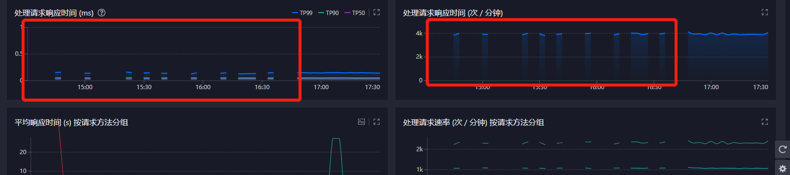
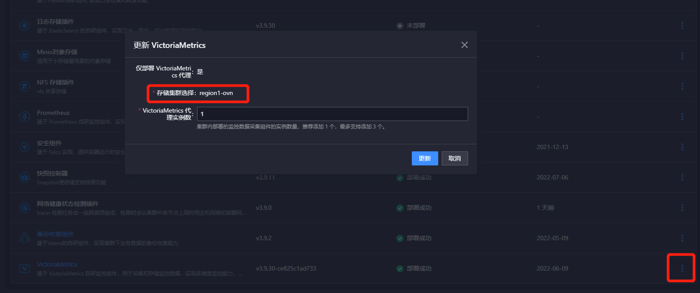
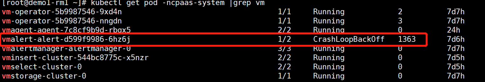
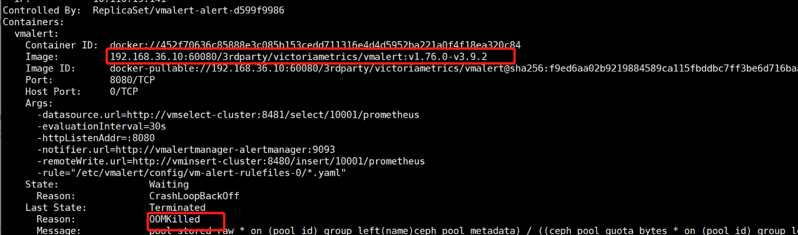
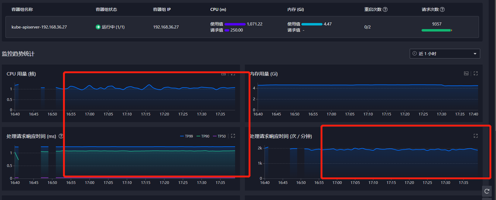

---
kind:
  - Troubleshooting
products:
  - Alauda Container Platform
  - Alauda DevOps
  - Alauda AI
  - Alauda Application Services
  - Alauda Service Mesh
  - Alauda Developer Portal
ProductsVersion:
  - 4.1.0,4.2.x
---
<!-- A type of document that involves encountering a fault, diagnosing it, performing root cause analysis, and providing solutions. -->

# 3.9 VictoriaMetrics监控断续问题

集群监控断续 vmalerts-alert组件启动异常

## Cause
- vmalerts组件因默认内存配置200M不足导致OOM

## Resolution
- 修改vmalerts资源配置，将内存从200M增加至800m
- 执行命令 kubectl edit vmalerts.operator.victoriametrics.com -n ncpaas-system alert 更新配置

## [workaround]

## [Related Information]
**Screenshots**

- Environment: VictoriaMetrics 3.9
- vmalerts.operator.victoriametrics.com
- kubectl edit
- vmalerts-alert
- Component: Kubelet
- Page ID: 124686887
- Original Title: 3.9 VictoriaMetrics监控断续问题
