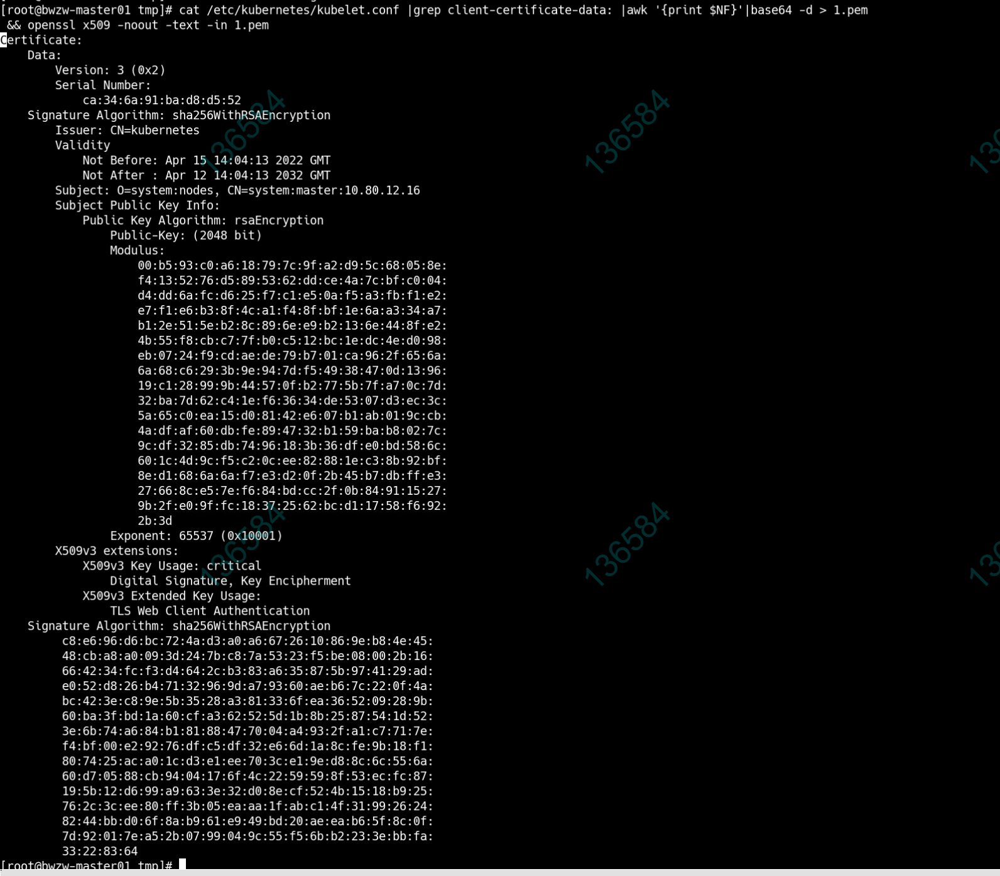

---
kind:
  - Troubleshooting
products:
  - Alauda Container Platform
  - Alauda DevOps
  - Alauda AI
  - Alauda Application Services
  - Alauda Service Mesh
  - Alauda Developer Portal
ProductsVersion:
  - 4.1.0,4.2.x
---
<!-- A type of document that involves encountering a fault, diagnosing it, performing root cause analysis, and providing solutions. -->

# 3.4.2

master1节点kubelet服务异常 kubelet.conf证书CN字段异常

## Cause
- kubelet.conf证书中CN字段被错误签发为system:master

## Resolution
- 执行证书更新脚本更新证书字段为system:node
- 修改kubelet.conf文件内容
- 重启kubelet服务

## [workaround]

## [Related Information]
**Screenshots**

- Environment: 3.4.2版本纳管的2.9业务集群
- kubelet.conf
- kubelet证书
- update-slave.sh
- kubelet服务
- Component: Kubelet
- Page ID: 124696580
- Original Title: 3.4.2-基础架构-业务集群master1节点异常
