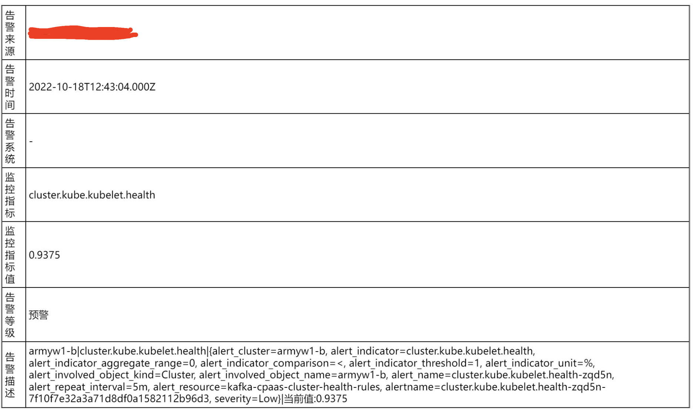
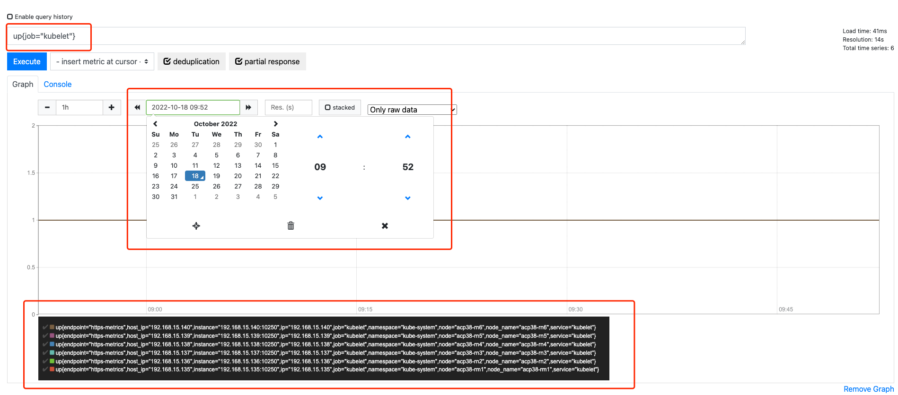

---
kind:
  - Troubleshooting
products:
  - Alauda Container Platform
  - Alauda DevOps
  - Alauda AI
  - Alauda Application Services
  - Alauda Service Mesh
  - Alauda Developer Portal
ProductsVersion:
  - 4.1.0,4.2.x
---
<!-- A type of document that involves encountering a fault, diagnosing it, performing root cause analysis, and providing solutions. -->

# kubelet监控告警

kubelet健康程度小于100% kubelet宕机2分钟

## Cause
- kubelet进程异常
- 节点资源不足
- 网络中断
- 节点故障

## Resolution
- 检查10.20.198.3节点kubelet日志：journalctl -u kubelet
- 检查节点资源使用情况（内存/CPU/磁盘）
- 验证节点网络连通性
- 重启故障节点kubelet服务：systemctl restart kubelet

## [workaround]
- 临时重启kubelet服务
- 将工作负载迁移到健康节点

## [Related Information]
**Screenshots**

- Environment: TKE 3.6
- up{job="kubelet"}
- kubelet.service
- 10.20.198.3
- /var/log/messages
- Component: Kubelet
- Page ID: 133075497
- Original Title: kubelet监控告警
