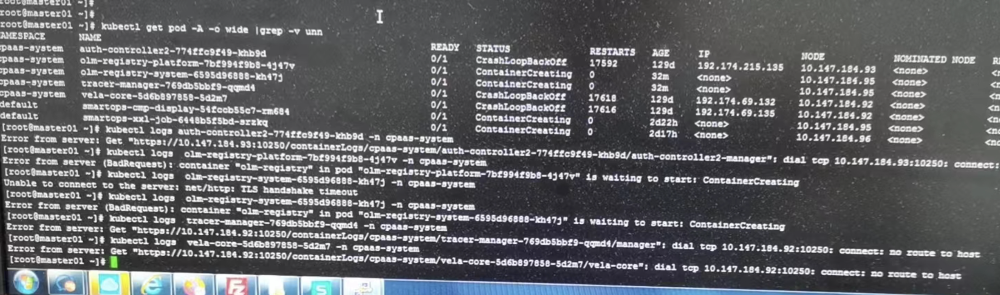

---
kind:
  - Troubleshooting
products:
  - Alauda Container Platform
  - Alauda DevOps
  - Alauda AI
  - Alauda Application Services
  - Alauda Service Mesh
  - Alauda Developer Portal
ProductsVersion:
  - 4.1.0,4.2.x
---
<!-- A type of document that involves encountering a fault, diagnosing it, performing root cause analysis, and providing solutions. -->

# kubectl logs失败

kubectl logs失败 dial tcp 10.147.184.92:10250: connect: no route to host node节点到master节点telnet 10250端口不通

## Cause
- master节点存在异常iptables drop规则

## Resolution
- 清空iptables规则：iptables -F && iptables -F -t nat
- 重启服务：systemctl restart network docker kubelet

## [workaround]

## [Related Information]
**Screenshots**

- Environment: TKE 3.6
- 10250端口
- kubelet
- iptables
- tunl0接口
- pod IP
- Component: Kubelet
- Page ID: 133076140
- Original Title: kubectl logs失败
