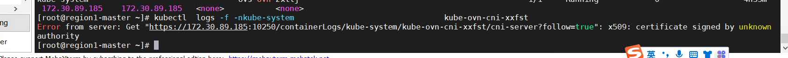

---
kind:
  - Troubleshooting
products:
  - Alauda Container Platform
  - Alauda DevOps
  - Alauda AI
  - Alauda Application Services
  - Alauda Service Mesh
  - Alauda Developer Portal
ProductsVersion:
  - 4.1.0,4.2.x
---
<!-- A type of document that involves encountering a fault, diagnosing it, performing root cause analysis, and providing solutions. -->

# 3.10

kubectl logs 无法查看计算节点上pod的日志，报错x509认证失败

## Cause
- 3.10升级后kubeadm的configmap未增加kubelet证书路径配置，kubelet-config缺少tlsCertFile/tlsPrivateKeyFile定义

## Resolution
- 手动修改/var/lib/kubelet/config.yaml添加tlsCertFile: /etc/kubernetes/pki/kubelet.crt和tlsPrivateKeyFile: /etc/kubernetes/pki/kubelet.key配置，重启kubelet服务

## [workaround]

## [Related Information]
**Screenshots**

- Environment: v3.8升级到v3.10的容器平台，业务集群创建于v3.8版本
- kubelet
- kubeadm
- kubelet-config
- /var/lib/kubelet/config.yaml
- tlsCertFile
- tlsPrivateKeyFile
- /etc/kubernetes/pki/kubelet.crt
- /etc/kubernetes/pki/kubelet.key
- Component: Kubelet
- Page ID: 133091906
- Original Title: 3.10-容器平台-kubectl logs 无法查看计算节点上pod的日志
