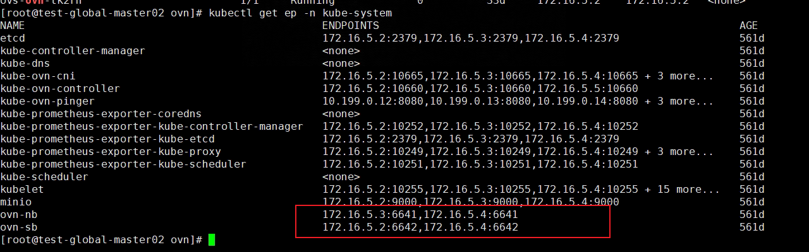
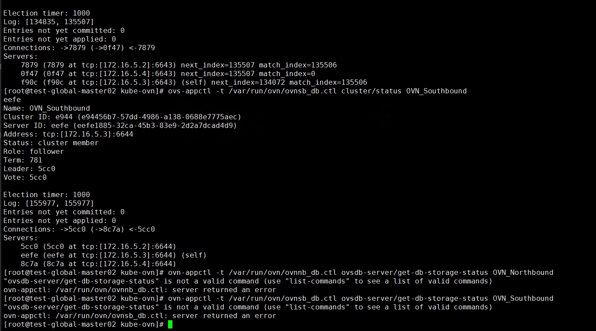

---
kind:
  - Troubleshooting
products:
  - Alauda Container Platform
  - Alauda DevOps
  - Alauda AI
  - Alauda Application Services
  - Alauda Service Mesh
  - Alauda Developer Portal
ProductsVersion:
  - 4.1.0,4.2.x
---
<!-- A type of document that involves encountering a fault, diagnosing it, performing root cause analysis, and providing solutions. -->

# 3.6.2

pod处于pending状态 ovn集群状态异常 4节点数据异常

## Cause
- ovn集群中nb/sb存在异常节点

## Resolution
- kubectl get ep -n kube-system ovn-nb/ovn-sb检查leader Pod IP
- ovs-appctl -t /var/run/ovn/ovnnb_db.ctl cluster/status OVN_Northbound
- ovs-appctl -t /var/run/ovn/ovnsb_db.ctl cluster/status OVN_Southbound
- ovs-appctl -t /var/run/ovn/ovnnb_db.ctl cluster/kick OVN_Northbound <ID>
- ovs-appctl -t /var/run/ovn/ovnsb_db.ctl cluster/kick OVN_Southbound <ID>
- 重启4节点ovn-central

## [workaround]

## [Related Information]
**Screenshots**
2、排查事件发现ovn网络存在问题，查看ovn集群ep发现nb和sb有两个节点，查看ovn集群状态异常
3、排查发现4节点数据异常
- Environment: 3.6.2
- ovn-nb
- ovn-sb
- ovn-central
- /var/run/ovn/ovnnb_db.ctl
- /var/run/ovn/ovnsb_db.ctl
- Component: Kubelet
- Page ID: 133091968
- Original Title: 3.6.2-容器平台-业务集群无法创建pod
