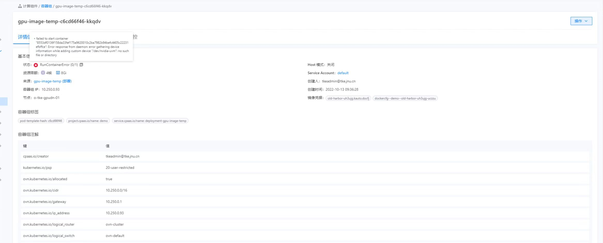
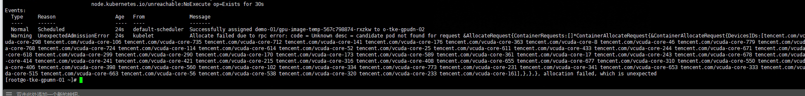
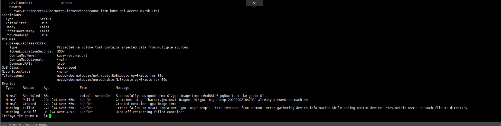

---
kind:
  - Troubleshooting
products:
  - Alauda Container Platform
  - Alauda DevOps
  - Alauda AI
  - Alauda Application Services
  - Alauda Service Mesh
  - Alauda Developer Portal
ProductsVersion:
  - 4.1.0,4.2.x
---
<!-- A type of document that involves encountering a fault, diagnosing it, performing root cause analysis, and providing solutions. -->

# 3.8.1

gpu应用创建失败 配置虚拟cpu后启动异常报错 调度节点缺少nvidia-uvm模块

## Cause
- 配置虚拟cpu导致调度异常
- 机器重启后nvidia-uvm模块未加载

## Resolution
- 在gpu节点的kubelet服务中添加ExecStartPre命令加载nvidia-uvm模块
- 修改/etc/systemd/system/kubelet.service文件，添加ExecStartPre=/bin/bash -c 'modprobe nvidia-uvm;nvidia-modprobe -u -c=0'

## [workaround]
- 手动执行nvidia-modprobe -u -c=0命令加载模块

## [Related Information]
**Screenshots**

1、配置虚拟cpu后启动异常，报错，去掉虚拟cpu配置虚拟内存正常运行
2、查看事件发现调度节点上缺少nvidia-uvm 手动添加nvidia-modprobe -u -c=0后调度恢复正常
- Environment: 3.8.1
- nvidia-modprobe
- nvidia-uvm
- kubelet.service
- 虚拟cpu配置
- 虚拟内存配置
- Component: Kubelet
- Page ID: 133091977
- Original Title: 3.8.1-容器平台-gpu应用创建失败
