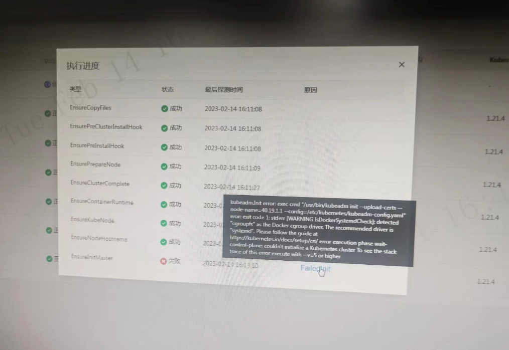
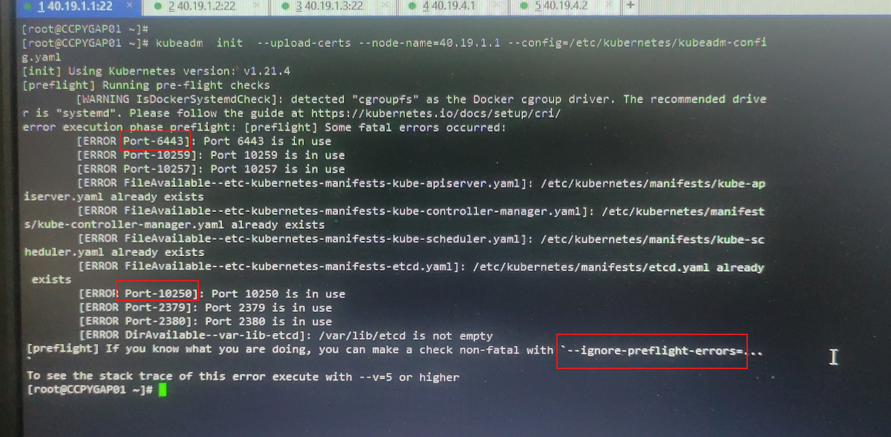
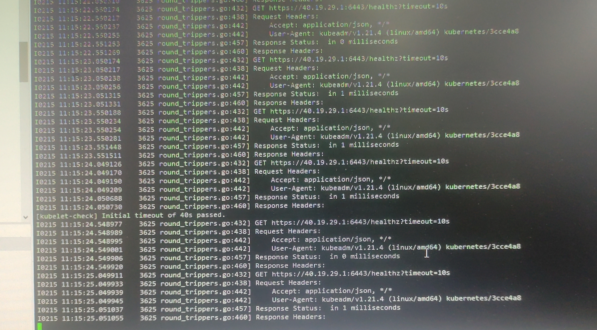

---
kind:
  - Troubleshooting
products:
  - Alauda Container Platform
  - Alauda DevOps
  - Alauda AI
  - Alauda Application Services
  - Alauda Service Mesh
  - Alauda Developer Portal
ProductsVersion:
  - 4.1.0,4.2.x
---
<!-- A type of document that involves encountering a fault, diagnosing it, performing root cause analysis, and providing solutions. -->

# 创建集群卡在EnsureInitMaster失败

创建集群卡在EnsureInitMaster步骤 kubeadm init卡在连接vip:6443

## Cause
- vip配置为七层HTTP转发

## Resolution
- 将vip转发配置改为四层TCP
- 重新部署集群

## [workaround]

## [Related Information]
**Screenshots**

- Environment: v3.6/v3.8
- vip:6443
- kubeadm init
- 健康检查配置
- TCP四层配置
- Component: Kubelet
- Page ID: 136539953
- Original Title: 创建集群卡在EnsureInitMaster失败
