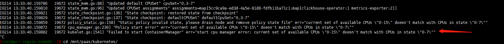
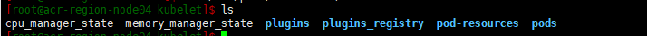

---
kind:
  - Troubleshooting
products:
  - Alauda Container Platform
  - Alauda DevOps
  - Alauda AI
  - Alauda Application Services
  - Alauda Service Mesh
  - Alauda Developer Portal
ProductsVersion:
  - 4.1.0,4.2.x
---
<!-- A type of document that involves encountering a fault, diagnosing it, performing root cause analysis, and providing solutions. -->

# ACP on CCE场景节点资源扩容后，节点not ready

节点无法正常ready kubelet日志显示cpu、内存数据不匹配

## Cause
- kubelet的cpu_manager_state/memory_manager_state文件未更新导致资源分配信息不一致

## Resolution
- 删除/mnt/paas/kubernetes/kubelet/cpu_manager_state memory_manager_state
- 执行systemctl restart kubelet重启服务

## [workaround]

## [Related Information]
**Screenshots**

- Environment: CCE 3.10.2版本
- kubelet
- cpu_manager_state
- memory_manager_state
- /var/paas/sys/log/kubernetes/kubelet.log
- Component: Kubelet
- Page ID: 136541206
- Original Title: ACP on CCE场景节点资源扩容后，节点not ready
