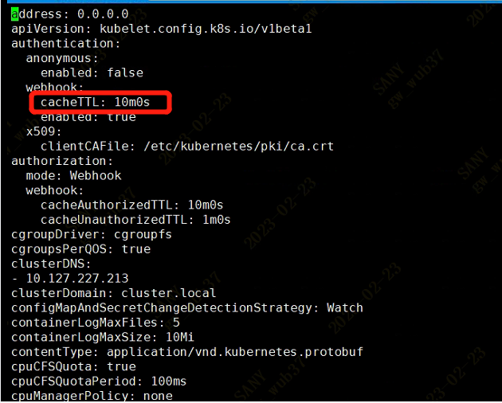

---
kind:
  - Troubleshooting
products:
  - Alauda Container Platform
  - Alauda DevOps
  - Alauda AI
  - Alauda Application Services
  - Alauda Service Mesh
  - Alauda Developer Portal
ProductsVersion:
  - 4.1.0,4.2.x
---
<!-- A type of document that involves encountering a fault, diagnosing it, performing root cause analysis, and providing solutions. -->

# kubelet日志报错

kubelet日志报错：Failed to make webhook authenticator request: rate: Wait(n=1) would exceed context deadline kubelet日志报错：Unable to authenticate the request due to an error: rate: Wait(n=1) would exceed context deadline

## Cause
- webhook身份验证请求速率限制导致超时

## Resolution
- 调整节点/var/lib/kubelet/config.yaml中的cacheTTL参数为10m0s，并重启kubelet
- 升级Kubernetes版本至1.21+

## [workaround]

## [Related Information]
**Screenshots**

- Environment: k8s1.19.9
- kubelet
- /var/lib/kubelet/config.yaml
- cacheTTL
- https://github.com/kubernetes/kubernetes/issues/95211
- Component: Kubelet
- Page ID: 139657381
- Original Title: kubelet日志报错-Failed to make webhook authenticator request: rate: Wait(n=1) would exceed context deadline
