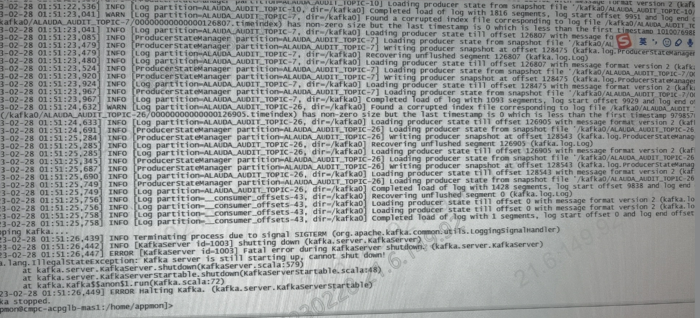
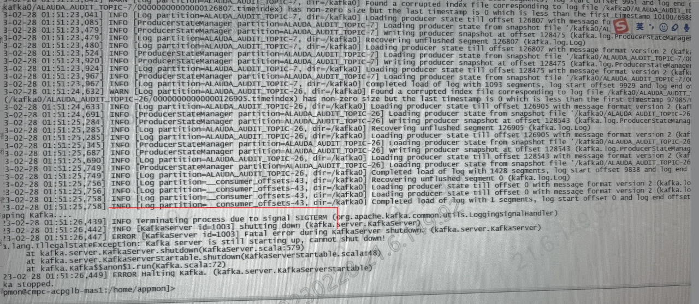

---
kind:
  - Troubleshooting
products:
  - Alauda Container Platform
  - Alauda DevOps
  - Alauda AI
  - Alauda Application Services
  - Alauda Service Mesh
  - Alauda Developer Portal
ProductsVersion:
  - 4.1.0,4.2.x
---
<!-- A type of document that involves encountering a fault, diagnosing it, performing root cause analysis, and providing solutions. -->

# cpaas

容器状态为Crashbackoff，持续重启 健康检查超时失败 日志报错：ERROR [KafakaServer id=1003] Fatal error during KafkaServer shutdown

## Cause
- kafka0目录堆积900G未消费数据导致启动时维护topic offset时间过长
- readiness/liveness探针时间配置过短导致维护未完成就被kubelet重启

## Resolution
- 移除cpaas-kafka deploy中的readiness和liveness探针配置
- 待kafka消费堆积减少至10G以下或无堆积后重新添加探针

## [workaround]

## [Related Information]
**Screenshots**

- Environment: 3.6.1
- readiness探针
- liveness探针
- kafka0目录
- topic offset信息
- Component: Kubelet
- Page ID: 140824199
- Original Title: cpaas-kafka重启后无法启动状态Crashbackoff
