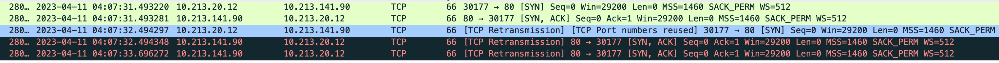
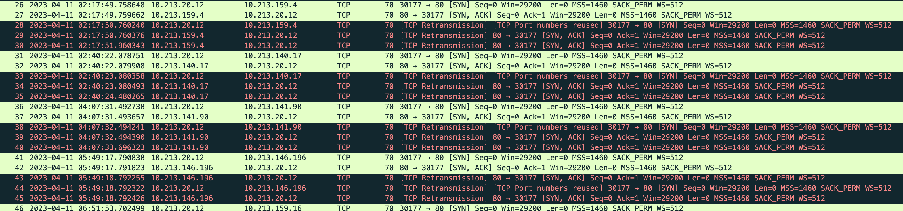

---
kind:
  - Troubleshooting
products:
  - Alauda Container Platform
  - Alauda DevOps
  - Alauda AI
  - Alauda Application Services
  - Alauda Service Mesh
  - Alauda Developer Portal
ProductsVersion:
  - 4.1.0,4.2.x
---
<!-- A type of document that involves encountering a fault, diagnosing it, performing root cause analysis, and providing solutions. -->

# kubelet 健康检查偶现失败

健康检查偶现失败，报错连接超时 TCP三次握手时出现网络包重传 Pod多的节点失败频率较高

## Cause
- 节点sysctl参数net.ipv4.ip_local_port_range(1024起)与NodePort端口冲突
- IPVS对NodePort 30177做了DNAT导致端口冲突

## Resolution
- 修改net.ipv4.ip_local_port_range为默认值32768 60999

## [workaround]

## [Related Information]
**Screenshots**

- Environment: Kube-OVN Underlay网络环境
- 30177端口
- NodePort Service
- IPVS DNAT
- net.ipv4.ip_local_port_range
- Component: Kubelet
- Page ID: 144913523
- Original Title: kubelet 健康检查偶现失败
