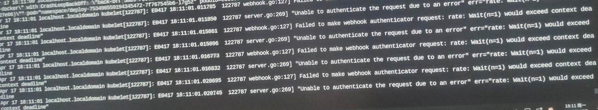
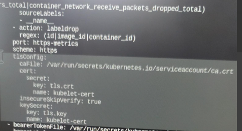

---
kind:
  - Troubleshooting
products:
  - Alauda Container Platform
  - Alauda DevOps
  - Alauda AI
  - Alauda Application Services
  - Alauda Service Mesh
  - Alauda Developer Portal
ProductsVersion:
  - 4.1.0,4.2.x
---
<!-- A type of document that involves encountering a fault, diagnosing it, performing root cause analysis, and providing solutions. -->

# 业务集群pod启动过慢，很长的一段时间处于pending状态

pod启动过慢，长时间处于pending状态 节点kubelet日志报错webhook相关超时信息

## Cause
- kubelet的webhook认证鉴权导致超时

## Resolution
- 编辑/var/lib/kubelet/config.yaml文件，设置authentication.enabled: false和authorization.mode: AlwaysAllow
- 创建证书secret: kubectl create secret tls kubelet-cert -n cpaas-system --cert /etc/kubernetes/pki/apiserver-kubelet-client.crt --key /etc/kubernetes/pki/apiserver-kubelet-client.key
- 修改ServiceMonitor kube-prometheus-exporter-kubelets的tlsConfig配置

## [workaround]
- 临时关闭kubelet的webhook认证鉴权功能

## [Related Information]
**Screenshots**

- /var/lib/kubelet/config.yaml
- ServiceMonitor/kube-prometheus-exporter-kubelets
- Secret/kubelet-cert
- /etc/kubernetes/pki/apiserver-kubelet-client.crt
- /etc/kubernetes/pki/apiserver-kubelet-client.key
- Component: Kubelet
- Page ID: 152647277
- Original Title: 业务集群pod启动过慢，很长的一段时间处于pending状态-kubelet-webhook导致
