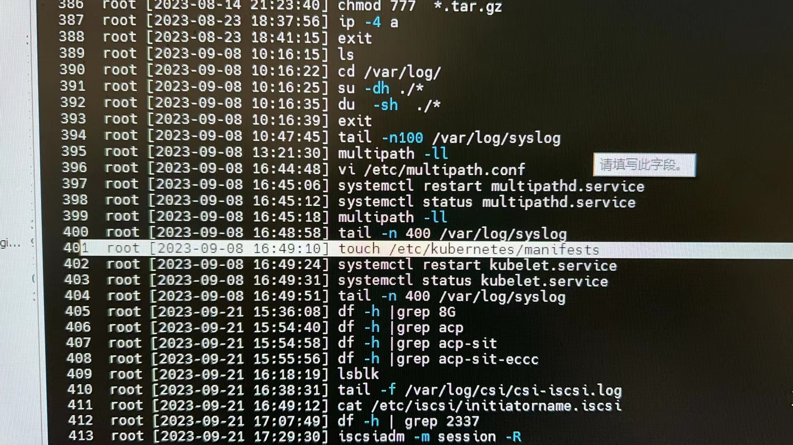

---
kind:
  - Troubleshooting
products:
  - Alauda Container Platform
  - Alauda DevOps
  - Alauda AI
  - Alauda Application Services
  - Alauda Service Mesh
  - Alauda Developer Portal
ProductsVersion:
  - 4.1.0,4.2.x
---
<!-- A type of document that involves encountering a fault, diagnosing it, performing root cause analysis, and providing solutions. -->

# 3.12.1

pod无法挂载pv kubelet日志报错：/etc/kubernetes/manifests: couldn't parse as pod(Object 'Kind' is missing in 'null')

## Cause
- /etc/kubernetes/manifests被错误修改为文件属性而非目录)

## Resolution
- rm -rf "/etc/kubernetes/manifests"
- mkdir /etc/kubernetes/manifests

## [workaround]

## [Related Information]
**Screenshots**

- Environment: 3.12.1
- kubelet
- xsky存储类
- /etc/kubernetes/manifests
- pv/pvc
- Component: Kubelet
- Page ID: 172526076
- Original Title: 3.12.1-pod无法挂载pv-对应存储类为第三方xsky
