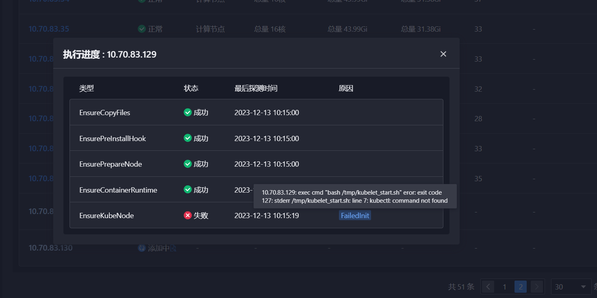
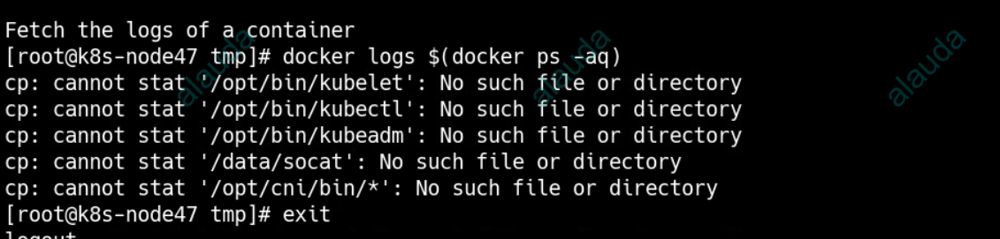
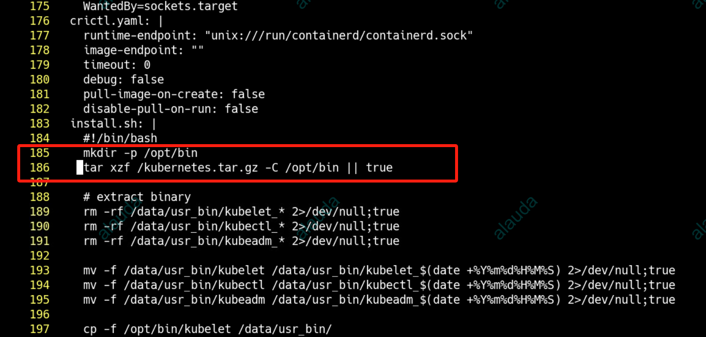

---
kind:
  - Troubleshooting
products:
  - Alauda Container Platform
  - Alauda DevOps
  - Alauda AI
  - Alauda Application Services
  - Alauda Service Mesh
  - Alauda Developer Portal
ProductsVersion:
  - 4.1.0,4.2.x
---
<!-- A type of document that involves encountering a fault, diagnosing it, performing root cause analysis, and providing solutions. -->

# 3.12

/tmp/kubelet start.sh: line 7: kubectl: command not found kube-node容器报错显示二进制文件缺失

## Cause
- kube-node 1.21.4镜像默认不包含kubectl等二进制文件，需通过tar解压获取
- 3.12.1版本global集群的kube-node-install-scripts配置缺失tar解压逻辑

## Resolution
- 升级业务集群k8s版本至1.21.10+（该版本镜像直接包含二进制文件）

## [workaround]
- 在global集群执行：kubectl edit cm -n cpaas-system kube-node-install-scripts
- 添加内容：
#!/bin/bash
mkdir -p /opt/bin
tar xzf /kubernetes.tar.gz -C /opt/bin || true
- 重启tke-platform-controller

## [Related Information]
**Screenshots**

、

- Environment: ACP 3.12.2 + 业务集群k8s 1.21.4 + global集群3.12.1
- kube-node-install-scripts
- kube-node容器
- kubernetes.tar.gz
- tke-platform-controller
- /opt/bin
- Component: Kubelet
- Page ID: 176883746
- Original Title: 3.12-业务集群新增节点报错-/tmp/kubelet start.sh: line 7: kubectl: command not found
