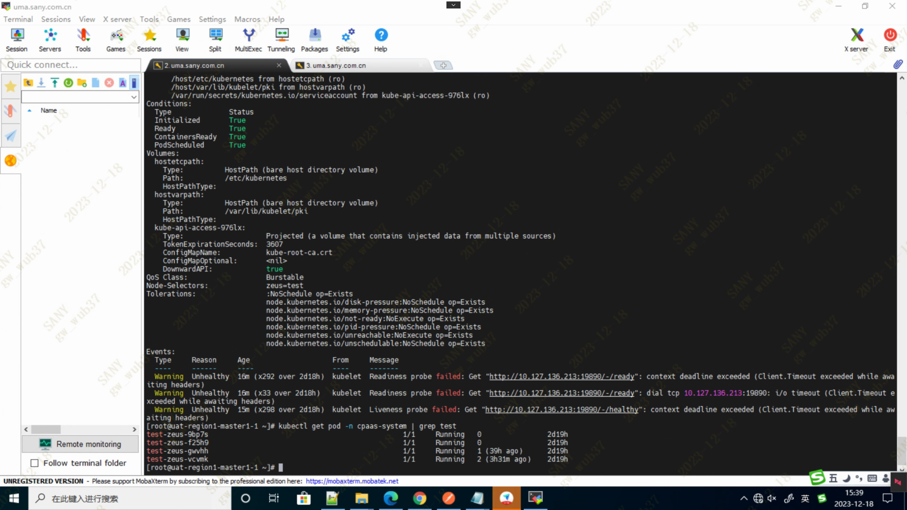
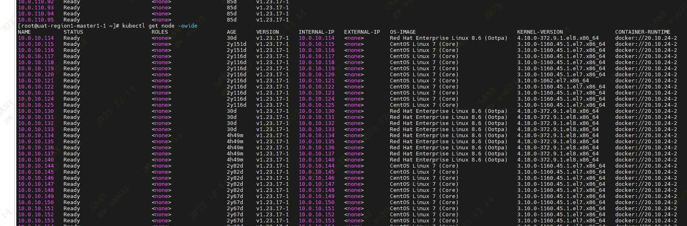
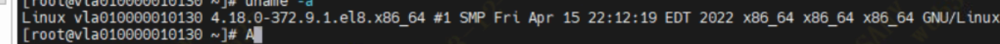
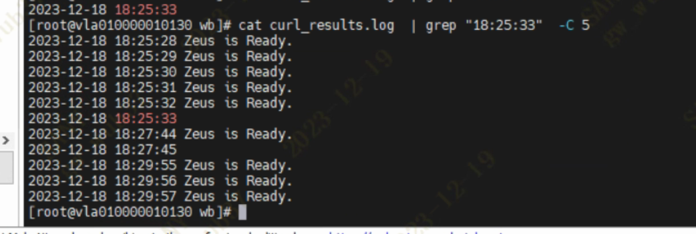
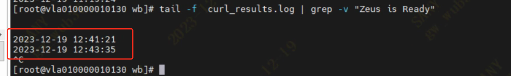
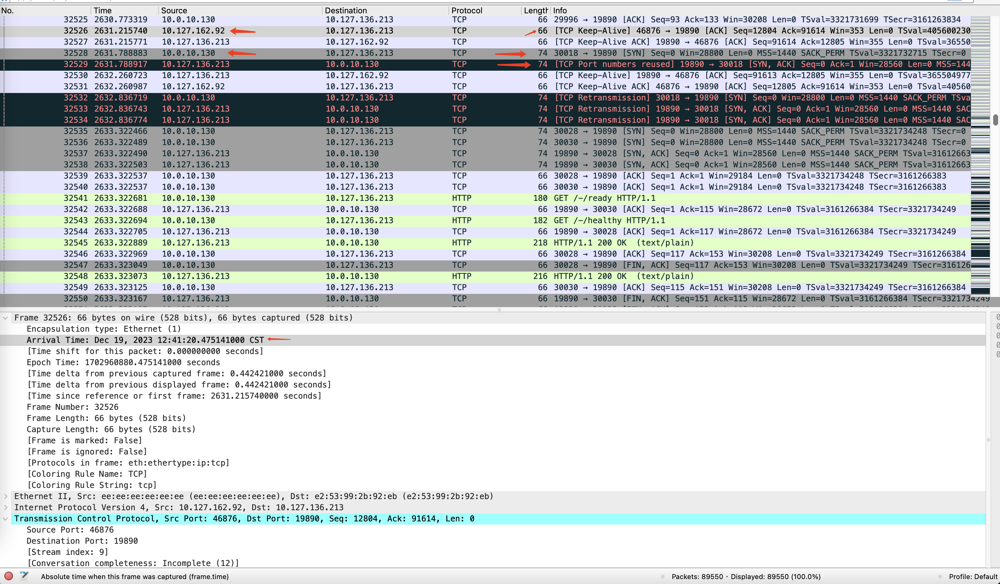
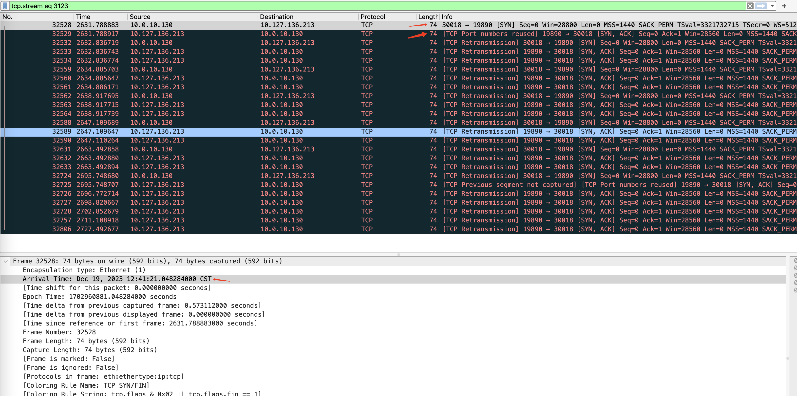
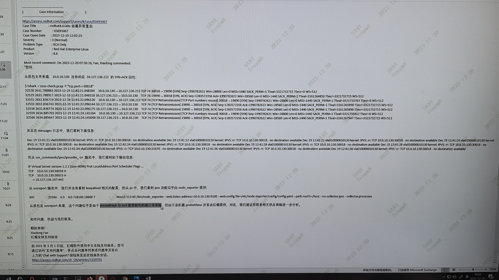
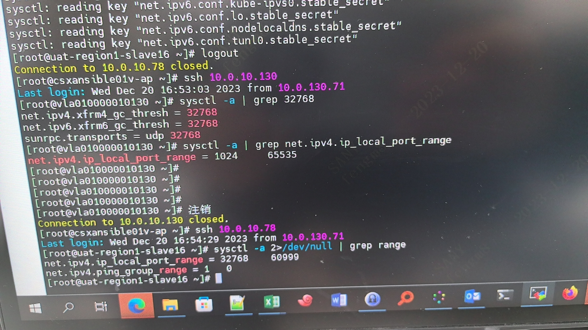

---
kind:
  - Troubleshooting
products:
  - Alauda Container Platform
  - Alauda DevOps
  - Alauda AI
  - Alauda Application Services
  - Alauda Service Mesh
  - Alauda Developer Portal
ProductsVersion:
  - 4.1.0,4.2.x
---
<!-- A type of document that involves encountering a fault, diagnosing it, performing root cause analysis, and providing solutions. -->

# 三一重工，redhat 8.0 节点，健康检查偶现失败

健康检查偶现超时 RedHat节点上curl健康检查地址偶现失败 抓包显示TCP Port Numbers reused

## Cause
- kubelet健康检查使用的源端口与NodePort服务端口冲突
- RedHat与CentOS节点的net.ipv4.ip_local_port_range参数取值范围配置不同

## Resolution
- 调整net.ipv4.ip_local_port_range参数范围，避免与NodePort端口范围(30000-32767)重叠

## [workaround]

## [Related Information]
**Screenshots**

- Environment: RedHat 8.0, kube-ovn v1.9.25, ACP 3.12
- cpaas-system/nevermore
- cpaas-system/zeus
- kubelet
- NodePort
- kube-ovn
- net.ipv4.ip_local_port_range
- Component: Kubelet
- Page ID: 178228396
- Original Title: 三一重工，redhat 8.0 节点，健康检查偶现失败
